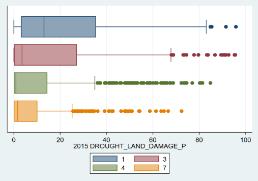

```{r setup, include=FALSE}
knitr::opts_chunk$set(cache=T)
#knitr::opts_chunk$set(fig_caption=F)

```
```{r Setup, include=FALSE, eval =T, cache=F}
#install Tex for latex  Windows: MiKTeX (Complete) - http://miktex.org/2.9/setup Mac OS X: TexLive 2013 (Full) - http://tug.org/mactex/ Linux: #sudo apt-get install texlive-full system 
#library(rticles) for knitter templates
#create rmarkdown from template then switch output: rticles::plos_article to output: word_document   
# bibliography will be grabed from bibliography: mybibfile.bib
rm(list=ls())

library(raster)
library(sp)
library(maptools)
library(ggplot2)
library(readstata13)
library(reshape)
library(rgdal)
#library(grid)
#library(gridExtra)

library(plotly)
library(plyr)
library(plm)
library(dplyr)
library(splines)
library(stargazer)
library(rasterVis)
#library(e1071)
library(randomForest)
library(caret)
library(doMC)
library(parallel)
library(DEoptim)
library(kernlab)
library(RANN)
library(pdp)
library(pander)
library(tidyr)

library(dplyr)
library(sf)
library(data.table)
#library(mapview)
#library(forestfloor)

# set up numbering for figures/graphs etc
Table_number = 1
Figure_number = 1
Appendix_Table_number =1
Appendix_Function_number =1
Formula_number = 1
Foot_number = 1
Home_dir = '~/Documents/IFPRI_Ethiopia_Drought_2016/IFPRI_Ethiopia_Drought_2016/'
```

\begin{abstract}
In this study, we provide evidence of localized clusters of drought in the 2015 growing season. We find scant evidence of substantial crop losses in the fifteen most productive zones, but instead that they were able to maintain or exceed production levels seen in 2014. That being said, there is a substantial uptick in the number of drought related losses reported by farmers, within localized areas, particularly in 2015. To explore the impact of these local droughts and management techniques on output per hectare, we develop a panel regression utilizing sub-kebele level agricultural survey data, and remotely sensed data on greeness, precipitation and measures of evaporative demand. We create a set of models to provide mid-season estimates of output per hectare for maize, wheat and barley, and obtain $R^{2}$ between 0.39 and 0.35 at the sub-kebele level. We also find crop specific responses to a variety of management practices, and climate conditions with $R^{2}$ between 0.47 and 0.31 at the sub-kebele level. We believe these models could be used to help monitor and predict yields for disaster response teams and policy makers to use, particularly with further development and integration of the newly available 30m Harmonized Landsat Sentinel (HLS) dataset. We further utilize our agricultural survey and remotely sensed data to develop machine learning models aimed at prediciting substantial crop losses (>25%) due to drought. These models predict, on an independent sample, substantial drought damage with over 95 percent accuracy with Kappa coefficients in the mid to high 60s. We consider these findings substantial because they reach accuracy levels meaningful for policy, but also because they are based largley on course (250m) resolution data and agricultural survey data that is often dismissed in the research community. In effect, we believe we have made some lemonade.  
 
\end{abstract}
 
\newpage 
 
 
#Introduction
The ability to monitor and predict crop yields in developing countries is critical to the successful adaptation to changes in our climate. Increased temperatures and variability has already been linked to losses in maize and wheat yields (-3.8 and 5.5% respectively) and crop prices globally [@Lobell616]. Although much effort has been placed on modeling the spatial distribution of these shifts, less effort has been placed on how yields vary across space and time especially in a longitudinal setting [@Ray2015]. Advances in remote sensing provide avenues to monitor agricultural crop health at high spatial and temporal resolution. However, our ability to monitor changes in plant productivity is still limited in the more complex environments common to many developing countries [@Mann2015]. 

Projections of climate change point to increasing severity and duration of extreme weather events, including drought [IPCC 2007ab]. Ethiopia is characterized by smallholder farmers dependent on rainfed crops with less than one percent of farmers having access to irrigation[mann warner 2015]. As such, Ethiopia's farmers are particularly vulnerable to inter- and intra-annual variation in rainfall. Although there has been substantial effort in improving the modeling and observation of weather and climate, observations of ground based measurements of agricultural outcomes and practices has been limited. One could aurgue without understanding, in detail, the impacts of changes in weather and climate on households' agriculture and wellbeing, much of climate science is meaningless. That being said, every year Ethiopia's Central Statistical Agency (CSA) carried out of the the largest household agricultural surveys in the world. The Agricultural Sample Survey (AgSS) captures data from over 45,000 households, and privides a critical view of agricultural yields, extension outreach, and farmers' practices in a spatially explicit manner.  

Remote sensing based efforts to characterize the extent, cultivation practices, and productivity of global croplands has a long history. Substantial progress has been made in mapping cropland extent, crop types, irrigation status, cropping intensity, and productivity from remotely sensed imagery. Remotely sensed imagery has also been employed to map irrigated areas [@thenkabail2009global, @portmann2010mirca2000], and cropping frequency/intensity [@biradar2011quantifying, @gray2014mapping, @li2014mapping]. Initial efforts (e.g. LACIE and AgRISTARS) primarily utilized remotely sensed imagery to characterize the spatial extent and growth stage of crops, but relied on models driven chiefly by meteorological information to predict crop yield [@idso1977remote, @doraiswamy2003crop]. However, the biophysical link between canopy spectral reflectance and net primary production has long been established [@tucker1986satellite]; indicating that satellite measurements could play a role in determining crop yield directly. A wide number of studies have documented highly explanatory empirical relationships between satellite measures such as NDVI (in many forms: growing season maximum and mean, seasonally integrated, etc.) and yields for a variety of crops, particularly at regional scales [@rasmussen1992assessment, @benedetti1993use, @funk2009phenologically, @becker2010generalized, @becker2010monitoring, @mkhabela2011crop]. Because certain crop growth stages are particularly critical for final yield [@butler2015variations], improved results are often seen when remotely sensed data are used to characterize crop phenology [@bolton2013forecasting].

Projections of climate change point to the increasing severity and duraction of extreme weather events, including drought, [IPCC 2007ab]. Ethiopia is characterized by smallerholder farmers dependent on rainfed crops with less than one percent of farmers having access to irrigation [mann warner 2015]. As such, Ethiopia's farmers are particularly vulnerable to inter= intr-annual variation in rainfall and temperatures. Although there has been substatnial effort in improving the modeing and observation of weather and climate, observations of ground based measuremesnts of agricultural outcomes and practices has been limited. One could aurgus without understanting, in detail, the impacts of changes in weather and climate on households, much of climate science is of limted vlue. That being said, every year Ethiopia's Central Statistical Agency (CSA) carries out one of the largest household agricultural surveys in the world. The Agricultural Sample Survey (AgSS) captures data from over 45,00 households, and provides a critical view of agricultural yields, extension outreach, and farmers' practices at a high spatial resolution. 


********************************************

The main objectives of this paper is to create a suite of models that can a) provides reliable estimates of yields based on remotely sensed data, b) reveal insights into the impacts of management. We also create a suite of algorithms used to extract, summarize, and organize remotely sensed data and prepare it for spatiotemporal analysis. 

##The State of Drought
Spurred by a long history of monsoon failures across the Sahel, forecasters and aid teams anxiously watched eastern Africa at the onset of a significant El Nino event in late 2014.  Reports of below average rainfalls in 2015-17 across the low lying pastoral communities and South Eastern Ethiopia triggered an international effort to provide food aid to roughly 8.5 million people in the summer of 2017 [@reliefweb2017, @reliefweb_2017b]. The understated response from the Ethiopian government has lead to accusations that the government is downplaying the severity of the drought as early as 2016 [@schemm_2016, @schemm_2017]. Despite the reality of a severe and crippling drought in food insecure low lying  areas, there is little sign of food shortages nationally, with a recent study observing no significant change in grain prices throughout the country [@bachewe_yimer_minten]. The lack of a price response would indicate that while food insecure areas were hit heavily by water shortages largely effecting livestock, while leaving the highland areas largely unaffected or triggering only minor losses. Despite international concern, conditions up until the 2016-2017 growing season may have been largely handled by domestic resources and trade flows, therefore requiring shifts in distribution rather than a large-scale international intervention.

\newpage
```{r Precipitation, echo=FALSE, message=FALSE, warning=FALSE}
 
# Drought Plots
setwd(Home_dir)

# ppt = stack(list.files('./Data/CHIRPS/','*.tif$',full.names = T))
# 
# idx = c(seq(as.Date("2009/1/1"), as.Date("2017/3/1"), "month"),seq(as.Date("2009/1/11"), as.Date("2017/3/11"), "month"),
#         seq(as.Date("2009/1/20"), as.Date("2017/3/20"), "month"))  # mimic Dekadal (10 days, 10 days, remainder)
# idx =sort(idx)
# ppt = setZ(ppt, idx)
# names(ppt) = idx
# 
# # get monthly median ppt through 2015 
# CHIRPS units total mm rain per 10 day period 

# Monthppt = stackApply(ppt[[1:252]], format(idx[1:252],'%m'), fun = median)
# names(Monthppt) = month.abb
# save(Monthppt, file = 'R:\\Mann_Research\\IFPRI_Ethiopia_Drought_2016\\IFPRI_Ethiopia_Drought_Code\\Writeup\\IFPRI 2016 Report Ethiopia\\Monthppt.R')
load('./Writeup/IFPRI 2016 Report Ethiopia/Monthppt.R') 

my.at <- seq(-10, 150, 10)
pptA = levelplot(Monthppt,at=my.at,layout=c(3, 4),par.settings=c(RdBuTheme()),scales=list(),main='(a) Median 2009-2015')

#get 2015 median ppt
# Monthppt2015C = stackApply(ppt[[ grep('2015',names(ppt))]], format(idx[grep('2015',idx)],'%m'), fun = median)
# names(Monthppt2015C) = month.abb
#  save(Monthppt2015C, file = 'R:\\Mann_Research\\IFPRI_Ethiopia_Drought_2016\\IFPRI_Ethiopia_Drought_Code\\Writeup\\IFPRI 2016 Report Ethiopia\\Monthppt2015C.R')
load('./Writeup/IFPRI 2016 Report Ethiopia/Monthppt2015C.R')
pptD = levelplot(Monthppt2015C,at=my.at,layout=c(3, 4),par.settings=RdBuTheme(), main='2015')

# get 2016 median ppt
# Monthppt2016C = stackApply(ppt[[ grep('2016',names(ppt))]], format(idx[grep('2016',idx)],'%m'), fun = median)
# names(Monthppt2016C) = month.abb
# save(Monthppt2016C, file = 'R:\\Mann_Research\\IFPRI_Ethiopia_Drought_2016\\IFPRI_Ethiopia_Drought_Code\\Writeup\\IFPRI 2016 Report Ethiopia\\Monthppt2016C.R')
load('./Writeup/IFPRI 2016 Report Ethiopia/Monthppt2016C.R')
pptC = levelplot(Monthppt2016C,at=my.at,layout=c(3, 4),par.settings=RdBuTheme(), main='2016')

pptchange2016 =(Monthppt2016C - Monthppt)
my.at2 <- seq(-65, 65, 5)
pptE = levelplot(pptchange2016,at=my.at2,layout=c(3, 4),par.settings=RdBuTheme(), main='(c) 2016 Deviation') #

pptchange2015 =(Monthppt2015C - Monthppt)
pptF = levelplot(pptchange2015,at=my.at2,layout=c(3, 4),par.settings=RdBuTheme(), main='(b) 2015 Deviation') #
```

*Figure `r paste(Figure_number)`: Median rainfall per 10 day period 2010-2015 compared to 2015 actual`r Figure_number =Figure_number+1 `*
  
```{r, echo=FALSE, warning=FALSE,fig.width=6,fig.align='center'}
plot(pptA)
plot(pptF)

#plot(pptE)
#pdf(figurepath, width = 8, height = 11) # Open a new pdf file
```


Looking at Figure `r paste(Figure_number-1)` we can see the spatiotemporal patterns of rainfall across Ethiopia. The top panel (a) reports the median total rain fall per 10 day period during each month (in mm). Here we can see the onset of the heavy rains during the Meher growing season, and the decline near harvest in October. In panels (b-c) we can see the deviation from this norm for the years 2015 and 2016 (in mm). The only striking shortfall is July in 2015 and patchy isolated declines through August that year. 2016 by comparison shows indications of generally above average rainfall. These figures also demonstrate the spatial heterogeneity of rainfall over time. Both years show small areas that interchange between having above or below average rainfall. It should be pointed out that the erratic nature of these rains might point to the importance of the timing of these rains, with rainfall being more important during critical growth stages like germination and flowering. If rains fail during critical periods, even small shortfalls can precipitate significant losses. Therefore Ethiopia, like many rainfall dependent countries has and will continue to be be prone to localized and occasionally wide-spread yield losses.  

*Figure `r paste(Figure_number)`: Total wheat output of top 15 producing zones in tons`r Figure_number =Figure_number+1 `*


Looking at the example of wheat production for the top 15 producing zones (Figure: `r paste(Figure_number-1)`), we can see that total output has remained steady or increased in the majority of top performing zones. This can be seen by the increase in total production from 49,500 in 2010 to 64,209 in the 2015 growing season. Additionally, we can see that the total production of each zone (as indicated by the width of each bar) generally increases over time, or remains relatively constant. Moreover we can see that the rank of regions (as indicated by the plot order, bottom being lowest rank, top being highest rank) remains surprisingly steady despite the exogenous shock of drought beginning in the 2015 planting season. We do however see a retraction in total output in 2015 due to the drought, however this only seemed to revert total yields to 2014 levels. 

```{r Drought in One Graph, include=F}
# Figure DROUGHT IN ONE GRAPH 
# Visualize stacked histograms of damage by type -------------------------------------
setwd(file.path(Home_dir,'/Outputs4Pred/'))
agss = read.dta13('./AgSS_2010_15_Compiled_panel_merged_clean_PCA_v4.dta') 
agss= agss[agss$REGIONCODE != 2,] # Drop afar

#WHEATDAMAGE_WEATHER_AREA_P,

damage = aggregate( cbind(WHEATDAMAGE_PESTS_AREA_P,WHEATDAMAGE_MANAGE_AREA_P,WHEATDAMAGE_OTHER_AREA_P,WHEATDAMAGE_DROUGHT_AREA_P) ~ REGIONCODE+Year, FUN = sum ,data=agss)
 
names(damage) = c('Region','Year','Pests','Manage','Other','Drought')
damage <- melt(damage, id=c("Region","Year"))
damage$regionyear = paste(damage$Region,damage$Year,sep='')
damage$Region[damage$Region==1]='Tigray'
damage$Region[damage$Region==3]='Amhara'
damage$Region[damage$Region==2]='Afar'
damage$Region[damage$Region==4]='Oromia'
damage$Region[damage$Region==5]='Somali'
damage$Region[damage$Region==6]='Benishangul'
damage$Region[damage$Region==7]='SNNP'

damage$Region = factor(damage$Region)
damage$Region = ordered(damage$Region, levels = c("Afar", "Benishangul", "Tigray",'SNNP','Amhara','Oromia'))
names(damage)[names(damage)=='variable'] = 'Type'

#ggplot(data=damage,aes(x = Year, y = value, colour=Region, fill=variable, group=regionyear)) +geom_bar(stat = "identity",position="dodge")


A = ggplot(data=damage,aes(x = Year, y = value,  fill=Type, group=Region)) +
  geom_bar(stat = "identity",position="stack",aes(alpha=0.8))+ scale_alpha(guide = 'none')+ 
  scale_fill_brewer(palette = "Set1",direction = -1)+
  facet_grid(.~(Region))+ylab('% of Planted Area Damaged')+ theme(axis.text.x = element_text(angle = 90))

# Visualize crop area by region -------------------------------------

  area = aggregate( cbind(WHEATAREA,MAIZEAREA,BARLEYAREA,SORGHUMAREA,TEFFAREA) 
                    ~ REGIONCODE+Year, FUN = sum ,data=agss)
  
  names(area) = c('Region','Year','Wheat','Maize','Barley','Sorghum','Teff')
  area = melt(area, id=c("Region","Year"))
  area$regionyear = paste(area$Region,damage$Year,sep='')
  area$Region[area$Region==1]='Tigray'
  area$Region[area$Region==3]='Amhara'
  area$Region[area$Region==2]='Afar'
  area$Region[area$Region==4]='Oromia'
  area$Region[area$Region==5]='Somali'
  area$Region[area$Region==6]='Benishangul'
  area$Region[area$Region==7]='SNNP'
  names(area)[names(area)=='variable'] = 'Crop'
  
  area$Region = ordered(area$Region, levels = c("Afar", "Benishangul", "Tigray",'SNNP','Amhara','Oromia'))
  area$value = area$value / 100  #scale 

  
  B = ggplot(data=area,aes(x = Year, y = value,  fill=Crop, group=Region)) +
    geom_bar(stat = "identity",position="stack",alpha=0.8 )+ scale_alpha(guide = 'none')+facet_grid(.~(Region))+ylab('Hectares of Crop (100s)')+
    theme(axis.text.x = element_text(angle = 90))

#  find proportion of total area for each crop by year  ------------------
  total_area = aggregate(value~Year, data = area,FUN=sum)
  names(total_area)[names(total_area)=='value']='Total_Area'
  crop_year_area = aggregate(value~Crop+Year, data = area,FUN=sum)
  names(crop_year_area)[names(crop_year_area)=='value']='crop_year_area'
  area2 = join(crop_year_area,total_area,by ='Year')
  area2$PerCropYear = area2$crop_year_area / area2$Total_Area *100
  
  
  B2= ggplot(data=area2,aes(x = Year, y = PerCropYear,  colour=Crop,alpha=0.8)) +
    geom_line( size=2 ) +ylab('% of Area Planted')+ scale_alpha(guide = 'none')+
    theme(axis.text.x = element_text(angle = 90))

#  find proportion of total area for each crop by year and Region -------------------
  Total_Area_Region = aggregate(value~Year+Region, data = area,FUN=sum)
  names(Total_Area_Region)[names(Total_Area_Region)=='value']='Total_Area_Region'
  
  
  crop_year_area_region = aggregate(value~Crop+Year+Region, data = area,FUN=sum)
  names(crop_year_area_region)[names(crop_year_area_region)=='value']='crop_year_area_region'
  area3 = join(Total_Area_Region,crop_year_area_region,by =c('Year','Region'))
  area3$PerCropYear = area3$crop_year_area_region / area3$Total_Area_Region *100
  
  
  B3 =  ggplot(data=area3,aes(x = Year, y = PerCropYear,  colour=Crop,alpha=0.8)) +
    geom_line( size=2 )+ scale_alpha(guide = 'none') + 
    ylab('% of Area Planted')+facet_grid(.~Region)+ theme(axis.text.x = element_text(angle = 90))

# Visualize crop area by region -------------------------------------
#WHEATDAMAGE_WEATHER_AREA_P,
oph = aggregate( cbind(WHEATOPH_W,MAIZEOPH_W,BARLEYOPH_W,SORGHUMOPH_W,TEFFOPH_W) 
                  ~ REGIONCODE+Year, FUN = median ,data=agss)

names(oph) = c('Region','Year','Wheat','Maize','Barley','Sorghum','Teff')
oph = melt(oph, id=c("Region","Year"))
oph$regionyear = paste(oph$Region,damage$Year,sep='')
oph$Region[oph$Region==1]='Tigray'
oph$Region[oph$Region==3]='Amhara'
oph$Region[oph$Region==2]='Afar'
oph$Region[oph$Region==4]='Oromia'
oph$Region[oph$Region==5]='Somali'
oph$Region[oph$Region==6]='Benishangul'
oph$Region[oph$Region==7]='SNNP'
names(oph)[names(oph)=='variable'] = 'Crop'

oph$Region = ordered(oph$Region, levels = c("Afar", "Benishangul", "Tigray",'SNNP','Amhara','Oromia'))
 
C=ggplot(data=oph,aes(x = Year, y = value,  fill=Crop, group=Region,alpha=0.8)) +
  geom_bar(stat = "identity",position="stack" )+ scale_alpha(guide = 'none')+
  facet_grid(Crop~Region)+ylab('Median Output Per Hectare')+ 
  scale_y_continuous(breaks=c(10, 20,30, 40))+ 
  theme(axis.text.x = element_text(angle = 90))

# version 1
#pdf("../Visualizations/DroughtIn1Graph.pdf", width = 8, height = 11) # Open a new pdf file
# grid.arrange(B,A,C,ncol=1,heights=c(.25,.25,.50))
#dev.off()
#grid.arrange(A,B2,C,ncol=1,heights=c(.25,.25,.50))


# write out pdf of figure 
figurepath = paste(Home_dir,"/Writeup//Figure_",Figure_number,"_DroughtIn1Graph.pdf",sep='')
if(file.exists(figurepath)){file.remove(figurepath)}
pdf(figurepath, width = 8, height = 11) # Open a new pdf file
grid.arrange(B,A,C,ncol=2,heights=c(.25,.25,.50))
# grid.arrange(A,B3,C,ncol=1,heights=c(.25,.25,.50))
dev.off()

```
We can see from Figure `r Figure_number` three time series for the major regions depicting the drought, in the top panel (a) the percentage of planted area damaged by damage type, the middle panel (b) the percentage of area planted in each major crop, in the bottom panel (c) median output per hectare (OPH) in quintiles for each major crop. Although we see a marked spike in reports of drought damage in the 2015 planting season (covering harvest in 2016), we see a few important responses. First, we see that although slight, farmers increased the percentage of area planted in drought tolerant crops such as maize and sorghum. Second, we see that although some regions saw declines in median output per hectare, these losses are largely offset by gains in other crops or by the steady increase in OPH since 2010. 

\newpage

*Figure `r paste(Figure_number)`: Drought in one graph 2010-2015`r Figure_number =Figure_number+1 `*

```{r Drought in one graph figure, echo=FALSE, fig.height=9, fig.width=8, message=FALSE, warning=FALSE}
grid.arrange(A,B3,C,ncol=1,heights=c(.25,.25,.50))
```

```{r Trade Flows,include=F}
# pdf inserted from Ethiopia Flow - Data v3.R in the H:/../Projects/Ethiopia Flow Maps/  folder
```
\pagebreak

<!-- Moreover Ethiopia has rapidly improved its ability to mitigate food insecurity through trade flows [@bachewe_yimer_minten]. International and international trade has likely been improved by the rapid development of the paved road network, and with the opening of the Ethiopia-Djibouti electric railway line in 2016 improving trade with this red sea port. Even in 2011, for the case of wheat, we can see how imports and internal trade flows move wheat from surplus areas to deficit areas. In Figure `r paste(Figure_number)`, we see large international imports as well as comprehensive internal trade flows at the zonal level.  -->

<!-- *Figure `r paste(Figure_number)`: 2010 aggregate wheat trade flows at the zonal level`r Figure_number =Figure_number+1 `* -->

<!--  -->
<!-- *Data obtained from [@bachewe_yimer_minten].* -->

<!-- Although far from perfect we should acknowledge substantial improvements in Ethiopia's ability to mitigate and respond to localized drought.  -->
Pulling from later in the study (see "Predicting Drought Damages"), we can see that although large-scale drought may have been elusive in 2015 for major growing regions, localed drought was not. Ethiopia has an extraordinary topography, with jagged mountains, rugged hilsides, and narrow canyons all being graded and tilled for agriculture. This complex terrain in turn leads to complex micro-climates in many ways much like those found in Eastern California. Rain shadows, elevation, strong inversion layers, monsoonal rain, complex wind patterns all lead to an extremely heterogenous growing environment, where conditions on one side of the mountain could be completely different than 1/2 a mile on the other. 

# Methods
## Data Sources
### Survey Data - Agricultural Sample Survey Data (2010-2015)
Survey data was obtained from Ethiopia's Central Statistical Agency's (CSA) Agricultural Sample Survey (AgSS) and was chosen for its annual collection, spatial coverage, and unique sampling structure through these six crop years. The AgSS is an annually collected government administered large-scale survey tasked with measuring agricultural production in Ethiopia at the zonal level [^agss].  The survey interviews approximately 45,000 farmers per year on a range of farm management questions covering some basic demographics of the household as well as a range of questions concerning planting, harvesting and selling at the plot level. Typically, about 20 farm households are randomly sampled from small local village-level areas of approximately 200 households (the sub-kebele level). On average, based on population, approximately five of these sample areas exist at the kebele-level administration area. Although the figures vary widely, sub-kebeles are meant to approximate about 200 households per unit and the average kebele has around 1,000 households each. From this sampling frame, a random selection of about 2,200 sub-kebeles are chosen as a representative sub-sample for zonal level production projections of major agricultural production areas. Population weights are then applied to project agricultural production at the zonal level. For this study, we construct a panel data set over the six crop seasons identified because approximately 75% of the same sub-kebeles were sampled by CSA over the six meher crop seasons of interest. This effectively builds a base of five relatively favorable crop seasons, from 2010 to 2014, and allows for the drought effects of 2015 as a study in contrast in terms of this significant weather event. The sample is with replacement and therefore representative of the sub-kebele but not a true panel because the same farmers were not chosen. In addition, no sampling weights are applied because we have omitted approximately 25% of the sample and are generally most interested in the localized effects.  

[^agss]: Beyond the nation, Ethiopia has four official levels of administrative areas. These include, in order of geographic size, regions, zones, woredas and kebeles.  There are approximately 12 regions, 88 zones, 690 woredas and 15,000 kebeles.  For our purposes, we use the sub-kebele, not recognized as a geographic region for administrative purposes, but commonly used for statistical sampling and are roughly based on population.  There are over 75,000 sub-kebeles in the country.

While this study collected data on the five principal Ethiopian field crops (teff, wheat, maize, barley, sorghum), because of their predominant importance in value terms for Ethiopia as well as their geographically wide-spread adoption, the analysis should therefore be placed within this context. This study covers the drought effects of only these five crops and not all agricultural production.  In other words, when we outline percentages of crop losses we are referring to losses of only these five crops and not total output in the country.  We have no reason to believe that these are not generally representative of all crop production, in terms of the drought, but a more detailed analysis would be needed to make this assertion. 

The principal unit of analysis is the sub-kebele and all relevant CSA data is aggregated to this level.  The survey data represents an amalgamation of all 20 households as a single representative farmer, we refer to as a "super-farmer." This was done for a variety of reasons including the fragmented plot farming system common in Ethiopia as well as CSA data collection methodology. More specifically, CSA data collection methodology relies on crop cuts to estimate productivity at the local level.  Depending on the actual number of farmers growing the specific crop, CSA collects up to five different individual farmer crop cuts, averages the yields, and projects this figure onto all plot areas for that crop in the sub-kebele.  In this way, individual plot level yields are not able to be determined and, consequently, household level estimates are not possible.  Additionally, while the level of the pixel used for the remote sensing data is relatively granular (6,250 m^2), cost and logistic considerations make plot level estimations prohibitive in this research.   Therefore, the data from 20 farmers is aggregated to a single super-farmer resulting in 1,780 observations sampled from the sub-kebele area (approximately 23,900,000 m^2) over a six-year period.  The total number of observations collected is about 10,680 but will vary in sample size depending on the crop choice (i.e.. some areas do not grow all five designated crops).  A breakdown of each super-farmer is done with aggregated non-crop related information combined with the specificity of the individual crop chosen.  More precisely, several variables are consistent across all five crop choices (elevation, proportional numbers of male and female household heads, total land area, etc.) and others are crop specific (use of fertilizer, seed, etc.).  Each crop year was checked for consistency, cleaned and aggregated to the sub-kebele level.  The six years where then aggregated and merged with other data to develop the panel data set.  Importantly, for our analysis, we chose specific variables to reflect farmer management decisions and other actions affecting yields. For data cleaning, we Winsorize yield estimates capping them at the 90th percentile, and we also drop any sub-kebele unit that has less than 4 years of data from regressions. 

###Remotely Sensed Data - Greeness, Precipitation and Evaporation
####Normalized Difference Vegetation Index
Considering the relatively small scale of agriculture in this region we use 250m vegetation products from the MODIS satellites. Vegetation indices are obtained from two 16-day MODIS products (MOD13Q1, MYD13Q1) from the Aqua and Terra satellites [@didan2006modis]. Due to the staggered nature of acquisition, these products are treated as partially overlapping windows representing 8-day periods [@doraiswamy2007crop]. We find that the combination of these two products provides a stable and informative time series.

For the sake of simplicity and replicability, we focus on the Normalized Difference Vegetation Index (NDVI) and examine its predictive power using panel econometric techniques. NDVI is sensitive to the amount of chlorophyll in any given pixel and is commonly used to estimate plant productivity and health in agricultural applications [@Mann2017,@Mann2015,@funk2009phenologically]. After removal of snow, cloud and other flagged low quality cells, we remove all non-agricultural cells through the use of the 500m MODIS land cover product (MCD12Q1) for the appropriate year.

####Water Availability Variables
In order to estimate the effects of precipitation (PPT)  on our crop production models the Climate Hazards Group Infrared Precipitation Station (CHIRPS) data was included. Data is collected as total precipitation by dekadal [@funk2015climate]. A dekadal represents three periods each month, the first two periods being 10 days each, and the third being any remaining days of that month.

Hydrological availability of water and available energy for plant growth have been shown in previous research to be important factors in crop models and are therefore included here. For this reason, we include monthly estimates of potential evaporation (PET) and actual evapotranspiration anomaly (ETA). Actual evapotranspiration (AET) is the sum of transpiration of water through plants plus evaporation from soils and water surfaces. AET is a correlated with vascular plant productivity and correlates with the biomass accumulation and regrowth[@major1967potential,@mann2016incorporating]#nowcastresults. The ETA variable used in this study is the current AET compared to the 2003-2013 mean. ETA therefore is a proxy for drought as low current values of AET would correspond to reductions either in available energy to move water, or water itself.  Potential evapotranspiration is an estimate of the total amount of water that could be moved through the system if water was not a limiting factor. As such it is an ideal indicator of available (or excessive) energy in the form of light and heat, but also includes the impact of wind speed, pressure, and humidity amongst others. The standard deviation of PET, reflects variability at the local level of these weather conditions.  Both ETA and PET are available for download through FEWS NET [@dataportals].

###Variable Definitions
*Table `r paste(Table_number)`: AgSS variable names & descriptions `r VarTableNum=Table_number` `r Table_number =Table_number+1 `*

```{r agss variable definition table, echo=FALSE}
definitions = read.csv('./AGSS Variable Description Table.csv',as.is = T)
definitions[1,1] = '$\\textbf{Prefixes}$' # insert bold text using latex
definitions[7,1] = '$\\textbf{Postfixes and Other}$'
definitions[10,1] = '$\\textbf{AgSS Variables}$'
definitions[19,1] = '$\\textbf{Other Geographic Variables}$'
 
#definitions
pander(definitions, justify = c('left', 'left'),split.cells = c(22,50))
#pandoc.table(definitions, style = 'rmarkdown')
```

*Table `r paste(Table_number)`: Remotely sensed variable names & descriptions `r VarTableNum=Table_number` `r Table_number =Table_number+1 `*

```{r remotely sensed variable definition table, echo=FALSE}
definitions = read.csv('./Variable Description Table.csv',as.is = T)
definitions[1,1] = '$\\textbf{Prefixes}$' # insert bold text using latex
definitions[7,1] = '$\\textbf{Postfixes and Other}$'
definitions[10,1] = '$\\textbf{NDVI Basic Summary Statistics}$'
definitions[19,1] = '$\\textbf{Other Basic Summary Statistics}$'
definitions[22,1] = '$\\textbf{Integrated Summary Statistics}$'
definitions[27,1] = '$\\textbf{Comparison to Norms}$'
 
#definitions
pander(definitions, justify = c('left', 'left'),split.cells = c(20,50))
#pandoc.table(definitions, style = 'rmarkdown')
```
##Spatial Considerations of the Drought
One issue of consequence in drought conditions, such as that in 2015, is to determine to what degree the drought is extensive or limited to a small number of areas. To aid in this process we utilize measures of spatial autocorrelation, one global and another local. Global measures of spatial autocorrelation evaluate whether or not observations of drought impacts are clustered (similar values are near each other), or whether they are spatial dispersed (dissimilar values are closer to each other) for the entire dataset. Local measures of spatial autocorrelation can pick up on local concentrations of high ("Hotspots") or low values ("Coldspots"). 

###Global Spatial Autocorrelation
Global Moran’s I depicts relative spatial autocorrelation for the entire area, where positive values convey clustering and negative values convey dispersion, and can be mathematically depicted by forumula`r moransi=Formula_number` `r paste(moransi)`: `r Formula_number=Formula_number+1` below.

(`r paste(moransi)`)                
$$\ I=\frac{n\sum_{i=1}^{N}\sum_{j=1}^{N}w_{ij}z_iz_j}{S_0\sum_{j=1}^{N}z_i^2}$$
where $z_i$ is the difference between a location *i* and its mean ($x_i-\bar{X}$), $w_{ij}$ is the spatial weight for feature *i* and it's neighbors *j*, *n* is the number of features, and $S_0$ is the aggregate of all spatial weights in formula`r s0=Formula_number` `r paste(s0)`: `r Formula_number=Formula_number+1` below:

(`r paste(s0)`)   
$$\ S_0=\sum_{i=1}^{N}\sum_{j=1}^{N}w_{ij}$$
Here we use neighborhood definition of a 25-km radius with a low decay rate of 0.05 power. This decay function suggests that about 85% of the total value of a neighbor 25 kms away.  

###Hotspot Analysis 
A typical method for identifying local spatial clustering is the Getis-Ord analysis that identifies spatial clustering of values that exist at the statistical tails of a distribution.  For our research, we identified “hot” neighborhoods that exist in the top 5% of a normal distributed of damage value and “cold” neighborhoods that exist in the bottom 5%.  In other words, does a group neighborhood value statistically deviate from the global mean?  In our case we defined a neighborhood as a 25-km radius from the centroid of the sub-kebele with a slight decay rate of 0.05 power[^hotspot].  

[^hotspot]: The issue of what defines a neighbor is somewhat controversial in the spatial literature and the choice has important impacts on the analysis. For our purposes, 25 kilometers seemed reasonable from both expert opinion and fit the actual distribution of the data well. 

Using Getis-Ord generates a Z-score and P-value for each sub-kebele in their respective neighborhood.  Equation (`r Formula_number`) demonstrates the spatial clustering with a 25-kilometer neighborhood and a small distance decay parameter as a weight.  A high Z score and small P value for a feature indicates a significant hot spot. A low negative Z score and small P value indicates a significant cold spot. The higher (or lower) the Z score, the more intense the clustering. A Z score near zero means no spatial clustering. See forumula`r F1=Formula_number` `r paste(F1)` `r Formula_number=Formula_number+1` below.

(`r paste(F1)`)                
$$\ G_i^*=\frac{\sum_{j=1}^{N}w_{ij}(d)x_{j}}{\sum_{j=1}^{N}x_{j}}$$
$$\ (d)=\Bigg\{\begin{matrix}\textrm{1, if } d_{ij}<d\textrm{ for all i,j}\\ \textrm{0, otherwise}\\\end{matrix}$$


## Estimating Crop Yields  
### Preprocessing 
####Data Aggregation
Because historical crop yields are only available at the level of certain political units (EAs in this case), pixel-level NDVI data must be aggregated at this same level. In this study, we calculate the mean across the raw NDVI values for all available agricultural pixels at the EA-level and further extract statistics of interest from this resulting time-series (at a frequency of 8-days).

####Summarizing Temporal Data
One of the primary challenges in utilizing high-frequency time series (8-day NDVI) to estimate low-frequency events (seasonal yields ) is in reconciling this temporal mismatch when formalizing the relationship between sources of data. In general, low-frequency properties must be extracted from the high-frequency time series that may be relevant to characterize and identify important aspects of plant phenology across the growing season that affect crop yields. 
In this paper we aim to capture relevant phenological features of wheat through 41 metrics summarizing 8-day NDVI data. These metrics cover Meher growing season statistics, spanning the estimated planting date until harvest date. These plant and harvest dates are estimated on a EA by EA basis, therefore differences in timing due to elevation, crop choice or other management considerations should be captured. 

We estimate three classes of statistics across each of these two distinct periods: summary statistics (e.g. mean, max, variance); integrated summary statistics (e.g. area under the curve for the first half of the growing season); and deviation from the norm statistics (e.g. deviations of a given statistic from its 90th historical percentile).

###"Now Casting" - Estimation Strategy
One primary use for these data is for early season estimation of crop yields. Although AgSS provides invaluable estimates of agricultural productivity on an annual basis, lag between data collection and release is substantial. This gap leaves substantial need to timely first-order estimates for crop yields. Modivated by prelimiary panel regression results reported in the [Appendix](#appendix_anchor), we find that reasonable estimates of output per hectare can be created around mid-season. Where 'mid-season' is defined by reaching the maximum NDVI greeness value.  

####Panel Regression for "Now-Casting"
Compared to cross-sectional approaches, panel analysis can substantially increase the degree of observed variance over both space and time. For instance, in our current application, the integration of EAS (with n = 1752) over the 2010-2015 sample period (t = 6), results in a substantially larger data (N~6900), allowing for a much greater flexibility and degrees of freedom in the modelling of the issue of interest. Here we include a series of variables that can be calculated in the first half of the growing season including contenporaneous and lagged values, Zonal fixed effects, as well as a lagged value of output per hectare. Here we estimate a series of random effect models of the following form`r F1=Formula_number` `r paste(F1)`: `r Formula_number=Formula_number+1`

(`r paste(F1)`)                
$$\ Y_{itc}=\alpha_{i}+\sum_{k=1}^{K}\beta_{k}X_{it}+ \mu_{it} +\epsilon_{it}$$
 
where $\ Y_{itc}$ is the output per hectare (OPH) for crop *c* for sub-kebele *i* for year *t*, $\alpha$ is the average output per hectare for sample population (all major growing regions), $\sum_{k=1}^{K}\beta_{k}X_{it}$ is the sum of all *K* coefficient estimates $\beta_{k}$ for all variables *X*, where *X* comprises all variables that are available a mid growing season, $\mu_{i}$ is the sub-kebele specific random effect that measures the difference between the average OPH at sub-kebele *i* and the average OPH in all major growing regions. The term $\epsilon_{it}$ is the individual-specific effect, which can be described as the deviation of the *i*th OPH from the average for that year.

We present preliminary "Now-Casting" results from panel regressions on output per hectare for Ethiopia's major crops *[here](#nowcastresults)*. 

## Predicting Crop Losses from Drought
Another critical emphasis of this project is to see if remotely sensed data on greenness, precipitation, or evapotranspiration and the zone code can be used in conjunction with household surveys to predict the location and/or extent of damages before the next years AgSS survey results are released. In this vein we aim to utilize advances from machine learning to accurately predict substantial crop damages for all major crops. We define our dependent variable, 'substantial' losses due to drought, as farmer reported losses over 25%. Two types of models are then run for each crop, one, a "national-level" model is trained on all observations for the major growing regions, and a second group of "region-level" models where each model is trained from data in a specific region. Specifically our model takes the following form:
`r F2=Formula_number` `r Formula_number=Formula_number+1`

(`r paste(F2)`) 
$$\ Y_{cn} = f(X)   $$
$$\ Y_{ci}=\Bigg\{\begin{matrix}\textrm{1, if drought loss > 0.25}\\ \textrm{0, otherwise}\\\end{matrix}$$

Where $Y_{ci}$ is a binary variable where losses for crop *c* due to drought in sub-kebele *i* are greater than 25%, and it is estimated a non-linear function of all remotely sensed variables of interest *X*.  We present results for damage predictions *[here](#damageresults)*

### Estimation Strategy
#### Random Forests Description
Random forests (RF) are a flexible (used for classification and regression) ensemble learning method that aggregates across multiple classification or regression trees each based on a randomized subset of variables. Each tree is formed through hierarchical splitting method where by each binary split (e.g. NDVI < 0.1) is identified as the most informative, as defined by the greatest reduction in Gini. This ensemble method improves performance by finding the mode or median of 'weak learners'. This process in turn allows RFs to avoid over-fitting and therefore perform consistently out-of-sample and with noisy data sets. 

#### Training vs Testing Data
Before we run any models we break the data into two groups, with 85% of all sub-kebele units being retained for the training and tuning of the models, and 15% of these held aside to provide independent measures of out-of-sample performance. 

#### Training Data: Cross Validation & Tuning
To enhance the performance of the models out-of-sample, we undertake two procedures on the training data; tuning and cross validation. Tuning in this case is limited to choosing the number of features (variables) randomly selected for use in each tree. We do a grid search independently for each crop finding the parameter tuning that provides the best performance. To ensure that these parameter tunings work well, we utilize k-fold cross validation whereby the training data is split further into 3 sets of sub-kebele data, the model is trained on two thirds of the data and its performance, using the Kappa coefficient, is estimated using the omitted third sub-sample. Performance for each parameter value is therefore evaluated out-of-sample three times and averaged. The optimal parameter then is that with the highest Kappa value and is specific for each crop model. Kappa[^kappa] is a performance indicator similar to the percentage of observations that are correctly classified but that controls for the fact that categories with large numbers of observations are easier to guess by random chance. 
[^kappa]: see: https://en.m.wikipedia.org/wiki/Cohen%27s_kappa    

#### Testing Data: Out-Of-Sample Performance
Independent of the training data we initially withheld 15% of sub-kebele units to provide 'testing data' for accurate measures of truly out-of-sample performance for our tuned RF models. These tests should therefore be good indicators of performance for sub-kebeles excluded from the AgSS survey. To test accuracy we make predictions of the damage category on this testing data and compare them to each observations observed damage category. We provide three major performance indicators, a) overall accuracy, 2) Kappa coefficient, and 3) the recall rate[^recall]. The same metrics are applied to both the national-level (all major growing regions), and the regional-level models (specific to each region).

[^recall]: the percentage of sub-kebeles with 'substantial drought damage' that are correctly classified by our models.

\newpage
# Results & Discussion

##Spatial Considerations of the 2015 Drought
TThe 2015 drought had varying spatial impacts on Ethiopia and this section seeks to review how the drought impacted cereal crop production at a variety of spatial scales.  We find that impacts generally occurred in local neighborhoods of relatively less productive areas.  This creates “pockets” of severly affected areas that has limited impacts on overall national production figures. Figure `r paste(Figure_number)` reveals that only two of the top ten cereal production zones, aggregated by weight, were significantly affected by the drought.More specifically, North Shewa of Amhara and East Shewa of Oromia. Importantly, they are ranked eighth and ninth with this ranking scale. Furthermore, higher impact areas were located in the north and northeast of the country.  Of critical importance is the fact that while larger administrative areas had greater impact there was significant variation at the local level. This is important because many designations of drought areas are determined at the woreda or higher administrative area level. With the high variance, this suggests that areas designated as drought areas may, in fact, not be experiencing these negative shocks.  We suggest a review of this research with an eye to using smaller level administrative areas such as the kebele for assistance.  In addition, time series trends of damage are fairly consistent suggesting longer term policy actions in these higher damage areas.

*Figure `r paste(Figure_number)`: Total Major Cereal Crop Production (by weight 2010-2015)`r totalweightprod =Figure_number; Figure_number =Figure_number+1 `*


Aggregated zonal cereal production is presented in Figure `r totalweightprod`[^rankweight]. The graph demonstrates relative stability of rankings and significant expansion of production for 2010 to 2015. Amhara and Oromia are the important zones, in terms of cereal production, and have the top 20 zones represented.  Of course, this has to do with population densities.

[^rankweight]: While aggregating the five crops by weight has some important methodological concerns, weight was used to measure relative loss in production rather than value lost.  Incorportaing a price index would speak to monetary value but the price changes might reflect market movements over drought effects.  For this reason, simple weight was used.  

*Figure `r paste(Figure_number)`: 2010-2015 Local clusters for the sum of drought related damages - All major crops`r droughclusterfig =Figure_number; Figure_number =Figure_number+1 `*

```{r Local Morans I, include=FALSE}
  library(spdep)
  Reg_poly = st_read("~/Documents/IFPRI_Ethiopia_Drought_2016/Data/AdminBoundaries/ETH_adm1_UTM.shp") 
  Reg_poly = st_transform(Reg_poly,"+proj=sinu +lon_0=0 +x_0=0 +y_0=0 +a=6371007.181 +b=6371007.181 +units=m +no_defs")

  # read in crop damage from All_Crops_Predict_Damages_to_all_EAs section
  EAs_point = readRDS('~/Documents/IFPRI_Ethiopia_Drought_2016/IFPRI_Ethiopia_Drought_2016/Outputs4Pred/allEAs_point_merge_agss.rds')
  EAs_point_crp=EAs_point[EAs_point$R_CODE %in% c(1,3,4,7),]  # keep major growing regions
  EAs_point_crp = EAs_point_crp[!duplicated(EAs_point_crp$geometry), ]  # remove duplicate points
  
  # use 25km as suggested by james
  # use 25km distance unless there are less than 8 neighbors, then use knn = 8 
  nb_25k = dnearneigh(st_coordinates(EAs_point_crp ), d1 = 0, d2 = 25000, row.names = seq(1,dim(st_coordinates(EAs_point_crp))[1]))
  k8nb = knearneigh(st_coordinates(EAs_point_crp ), k=8 )
  k8nb_nn  = split(as.data.frame(k8nb$nn), seq(nrow(as.data.frame(k8nb$nn)))) # convert nn to list 
  nb_knn8_25k = lapply(1:length(nb_25k), function(x){if(length(nb_25k[[x]])<8){
    return(as.integer(k8nb_nn[[x]]))}else{return(nb_25k[[x]])}}) # replace where less than 8 neighbors 
  attributes(nb_knn8_25k) = attributes(nb_25k) # keep nb attributes 
  
  loc_mor_25k = localmoran(EAs_point_crp$DamageSum_allcrops, nb2listw(nb_knn8_25k, style = "W"))
  EAs_point_crp$local_moran_p = loc_mor_25k[,'Pr(z > 0)']
  EAs_point_crp$local_moran_z = loc_mor_25k[,'Z.Ii']
  EAs_point_crp$local_moran_i = loc_mor_25k[,'Ii']
  EAs_point_crp$local_moran_z_sig = "Insignficant"  # find 95% signif
  EAs_point_crp$local_moran_z_sig[EAs_point_crp$local_moran_z > 1.96] = "Positive" 
  EAs_point_crp$local_moran_z_sig[EAs_point_crp$local_moran_z < -1.96] = "Negative" 
```
```{r Plot Local Morans I, echo=FALSE}
   # plot it 
  plot_dam_maz = ggplot()+  geom_sf(data=Reg_poly,  aes( ),fill = 'grey20',size=0.25 ) + geom_sf(data= EAs_point_crp[EAs_point_crp$local_moran_z_sig != "Insignficant" ,],  aes(color = local_moran_z_sig ),size=0.75, alpha=0.5) +scale_colour_manual(values =  c('#6dbcc6','#c65d5d'),name='Significant \nDamage Cluster')
  plot(plot_dam_maz)
```

To illustrate the localize nature of drought damages in Ethiopia from 2010-2015 we pull from the "Predicting Drought Damages" section of the paper. Figure `r droughclusterfig` above presents the results from a local Moran's I test on the sum of *drought related* damages for all major crops. The "Positive" class indicate a significant spatial cluster of high damage values based on a neighborhood of 25km, and "Negative" class indicates a signficant spatial clustering of low damage values. 

\newpage

*Table `r paste(Table_number)`: Average Cereal Crop Damage by Year (%)`r Crop_dam_table=Table_number` `r Table_number =Table_number+1 `*

```{r Crop damage by year table, echo=FALSE}
  # supplied by James from stata
  damage_table = data.frame(Year=seq(2010,2015),Mean=c(11.6,9.8,11.6,8.1,8.6,17.9),`Standard Deviation`=c(10.9,9.8,11.6,8.1,8.6,17.9),Minimum = rep(0,6),Maximum=c(83.2,76.1,79.1,60.5,94.0,95.8)) 
  pander(damage_table,justify = rep('center', 5))
```
                    N=1752 for all years 

Table `r Crop_dam_table` depicts average cereal crop loss across the selected sub-kebeles for the six-year period.  Overall average rates of cereal crop damage are relatively high for the six years sampled.  Typical damage reported was between 8 to 11% per sampled sub-kebele.  This suggests that about 10% of all cereal crops are lost due to various damages in a typical crop year.  As this is an average across 20 sampled farmers in the sub-kebele this figure does not account for variation within the sample.  In other words, individual farmers, or particular plots, may also experience catastrophic losses while others experience minor damage.  Policy to address this form of crop loss should be explored and could go a long way to addressing crop loss.  As expected, 2015 average crop loss rises dramatically.  However, it is important to point out that the 17.9% figure is not evenly applied across equally productive areas and so the total effects on nationally produced cereal crops is different than this figure indicates.

Global Moran’s I depicts relative spatial autocorrelation for the entire area, where positive values convey clustering and negative values convey dispersion.

*Figure `r paste(Figure_number)`: Indexed Global Moran’s I—Major Cereal Damage 2010-16 `r gmoransi =Figure_number; Figure_number =Figure_number+1 `*


While there is some statistically significant global clustering of damage of major cereal crops it is relatively low and demonstrates no observable trend (See Fig. `r gmoransi`).  This is an indication that ther are some areas of consistent damage but, as demonstrated later, local measures of spatial clustering provide a more nuanced view.  The AgSS allows for about 20 different types of damage (including different types of weather events (hail, floods drought), pest, birds and bad seed) but the clustering of drought impacted cereal crop damage jumped  over 7-fold in 2015.  The 2011 increase may refect a drought outlined in this period.  Overall, while there is some statistically significant global clustering, it is the 2015 drought that exhibits relatively dramatic differences.

*Figure `r paste(Figure_number)`: Drought Effects by Region `r droughtreg =Figure_number; Figure_number =Figure_number+1 `*



*Figure `r paste(Figure_number)`: Drought Effects by Zone: Tigray Region `r tigraydroughtreg =Figure_number; Figure_number =Figure_number+1 `*


Boxplots are presented of the four major regions in Figure `r droughtreg`.  What is evident from the Figure is that Tigray suffered the most overall damage, has the highest median damage and the widest distribution.  The 50% quartiles are more compact, indicating a tighter distribution, moving from northern Tigray to southern SNNP. In addition, the median is skewed far left for all regions suggesting non-normal distributions that large number of observations group towards zero with outliers of higher damage much farther to the left.   For example, approximately 50% of damage values are less than (2%) in both Oromia and SNNPR.  Figure `r tigraydroughtreg` splits Tigray region into smaller zonal drought effects.  The five zonal distributions are markedly with median values ranging from 5% to as high as 40%.  Both figures suggest wide impacts at both the region and intra-regional level.  The following figures drill down into smaller spatial scales and suggest this variation exists at the intra-zonal level as well.

*Figure `r paste(Figure_number)`: Drought Effects by Woreda: Zone 104 `r droughtworeda =Figure_number; Figure_number =Figure_number+1 `*


*Figure `r paste(Figure_number)`: Mao of Drought Effects by Zone: Tigray Region `r mapdrought =Figure_number; Figure_number =Figure_number+1 `*


Figure `r droughtworeda` demonstrates that the variability continues to exist down to the woreda level.  While the data is not as robust, given that the number of observations are fewer as higher levels of administrative units, values are wide-ranging and indicative of the localized effects of the drought.  When placed on a map, the sub-kebeles aggregations, potentially form neighborhoods of similar values that don’t necessarily respect administrative boundaries.  Broken into 20% categorical damage values, groupings of similar colors seem to present themselves in Figure `r mapdrought`. The 25 kilometer arrow indicates what will later be used as a neighborhood and is placed there for spatial context.  The next section attempts to demonstrate group clustering of “hot” (above average) and “cold” (below average) clustering of drought damage and investigates statistical patterns related to the drought.  

###Hotspot Analysis
In order to determine hot and cold spatial damage time trends, Getis-Ord analysis was performed on total damage per crop year.  This analysis identified local neighborhoods that deviated from the mean value of that year. Individual sub-kebeles were assigned a value of plus one, zero, or minus one if they were in the top 5%, middle 90%, or bottom 5% of neighborhood damage values, respectively for each year.  These values were summed for each of the six crop years. For example, a value of -2 indicates that for two crop seasons this particular sub-kebele was in statistically significant low damage neighborhoods. A summation of all values is provided in Table `r Table_number`.

*Table `r paste(Table_number)`: Cold/Hot Damage (per area)`r Dam_sum=Table_number` `r Table_number =Table_number+1 `*

```{r hotspot table, echo=FALSE}
  # supplied by James from stata
  panderOptions('keep.line.breaks', TRUE)
  hot_table = read.csv('sum_dam_hotspot.csv')
  names(hot_table)=c('Category',seq(0,6),'Total')
  pander(hot_table,justify = rep('center', 9))
```

Several important issues emerge from the hot/cold spot summation table[^tablexx]. Most notably, is the lack of sub-kebeles that had both hot and cold values. More specifically, only 23, or 1.3%, or all sub-kebeles had both positive and negative values.  This can be contrasted to 916, or 52%, of sub-kebeles that had either hot or cold values but not both. This suggests that there are certain areas prone to both above and below damage over time. Consistent areas of above and below damage which is explored later.

[^tablexx]:All possible values have been inserted into the table and zeros are entered where no value exists but would be theoretically possible.  In other words, since there was only six crop seasons included, a value of 5, -2 would not be possible.

*Table `r paste(Table_number)`: Cold/Hot Damage (per area)`r Dam_signif=Table_number` `r Table_number =Table_number+1 `*

```{r significant hotspot table, echo=FALSE}
  # supplied by James from stata
  panderOptions('keep.line.breaks', TRUE)
panderOptions('table.continues', '')
  signif_table = read.csv('dam_significant.csv')
names(signif_table)=c('Sub-Kebele Group','Obs','Hot/Cold Spots','Crop Damage','Elevation (m)', 'NDVI-AOC','PSNP (% of Total)','Access to Extension','Access to Extension (not Tigray)')
  pander(signif_table,justify = 'center',split.cells = c(9))
```
** Statistically significant at the 99% level (using relevant normal or non-parametric tests)

The values of Table `r Dam_signif` were divided into base years (2010-2014) and the specific 2015 hot drought year. The base years were averaged to determine “typical values” for each sub-kebele.  The goal was to explore predictable patterns for the 2015 drought versus non-drought sub-kebeles.  Importantly, many statistically significant differences emerge and suggest that base-line high damage areas were most effected by the drought and suggest a predictability to the impacts.

In total, 293 (16.7%) sub-kebeles experienced statistically significant, above average, neighborhood drought effects. For a variety of variables, statistical differences were found between the drought sub-set and the overall control group. At the very least, this suggests a non-random pattern to the 2015 drought.

The control and drought groups are divided areas that either experienced 2015 neighborhood drought effects or not.  The control group represents 1,459 or 83.3% of the entire sample and the remaining are the 2015 drought sub-group.Averages of all variables indicated in Table `r Dam_signif` are taken for 2010-2014 crop seasons and separated by categorical.  The results are striking and confirm that the drought effects were not randomly distributed.  For example, on average the control sub-kebeles experienced 0.2 number of cold spots across all years and essentially suggest no neighborhood effects of damage. On the other hand, each drought affected sub-kebele had an average of 1.4 damage hotspots. This indicates that areas that suffered from the drought, already where in high damage neighborhoods. This is confirmed by the percentage average damage from 2010-14 being about 76% greater on average (15.5% vs. 8.8%) BEFORE the drought year effects.  Other variables such as elevation and area of NDVI further suggest significant differences between the groups. The final four columns seek to identify relative policy actions existing in these two groups. 

Ethiopia’s Poverty Safety Net Program (PSNP) is an internationally recognized safety net program that provides a variety of social programs to assist poorer households.  There are approximately 200 woredas designated as PSNP. For our sample, 660 or 37.7% are in PSNP designated woredas. However, when separated by drought effects, about 30% are in non-drought areas and an astonishing 76.5% of PSNP samples are in drought neighborhoods. In other words, ¾ of all of the drought woredas are in PSNP designated areas, despite the fact that PSNP sub-kebeles make up less than 40% of the entire sample.  This suggests that this government project is relatively well positioned, at least relative to crop damage effects.  Average production losses, over the entire six-year period, in PSNP areas, is 17.9% versus 10.9% in non-PSNP areas. Another potential variable is extension services, although one could expect higher services in high production areas. Contrary to this expectation, extension services are disproportionally in drought areas but this is because the Tigray region experiences disproportionately high extension services. If Tigray is removed, there is no statistical difference. 

On the other hand, Agricultural Growth Program (AGP) woredas were selected in 2010 to represent high growth potential areas and are targeted for increased production.  As PSNP is social protection and AGP is high production we would expect little overlap of these two groups and actual comparisons confirm this to be the case. In our sample, contrasting the 190 woredas listed as PSNP and 81 listed as AGP, only 6 woredas are listed in both (5 from Tigray and 1 from SNNP). At the sub-kebele level, only 23 of the 1752 observations (1.3%) are listed in both. Unsurprisingly, these AGP woredas have far less damage to crops and suffered less in the 2015 drought. While the AGP sample represents 18.6% of all sampled sub-kebeles (326/1752), 21% of total sub-kebeles were not in high damage neighborhoods in 2015 and only 6.1%, or one-third the overall average, were in hot spots. Further, the non-AGP sub-kebeles had an average of 0.21 hotspots over the 2010-2015 period while the AGP woredas had an average of 0.47 cold spots over the six crop seasons. Finally, in terms of average crop losses over the six crop seasons, AGP sub-kebeles only had an average of 10.8% damage as contrasted to non-AGP value of 14.2%.  Overall, Table `r Dam_signif` reveal several statistically significant predictor variables that indicate the non-random effects of the drought.  

## Now Casting - Mid-Season OPH Estimates {#nowcastresults}
```{r Now Casting - Maize, fig.height=7, message=FALSE, warning=FALSE, include=FALSE}
  # read data
  setwd(Home_dir) 
  
  ######## MAIZE
  # read data
  data_in = read.dta13(paste("./Outputs4Pred/AgSS_2010_15_Compiled_panel_merged_clean_v4.dta",sep=''))
  data_in = data_in[,!(names(data_in) %in% c("_merge") ) ]
  
  # remove EA with less than 4 observations
  counts = as.data.frame(data_in  %>% group_by(EACODE) %>% summarise(non_na_count = sum(!is.na(BARLEYOPH_W))) %>% filter(non_na_count<4))
  data_in = data_in[!(data_in$EACODE %in% counts$EACODE),]
    data_in$dist_pp50k = base::scale(data_in$dist_pp50k, scale=F) # scale to avoid issues

  # define as panel data
  data_in_plm <- pdata.frame(data_in, index=c("EACODE","Year"),  row.names=TRUE)
  
  # add lag variables for agss
  data_in_plm$Fert_Amt_Per_Area = data_in_plm$MAIZEFERT_CHEMICAL_AMT / (data_in_plm$MAIZEFERT_CHEMICAL_AREA+1)
  data_in_plm$MAIZEOPH_W_lag  =       lag(data_in_plm$MAIZEOPH_W, 1)
  data_in_plm$MAIZEIMSEED_lag =       lag(data_in_plm$MAIZEIMSEED,1) 
  data_in_plm$MAIZEDAMAGEAREA_P_lag = lag(data_in_plm$MAIZEDAMAGEAREA_P,1)
  data_in_plm$Fert_Amt_Per_Area_lag = lag(data_in_plm$Fert_Amt_Per_Area,1) 
  data_in_plm$MAIZEEXTAREA_lag    =   lag(data_in_plm$MAIZEEXTAREA,1)
  data_in_plm$G_height_lag =          lag(data_in_plm$G_mx-data_in_plm$G_min,1)
  data_in_plm$G_height     =          data_in_plm$G_mx-data_in_plm$G_min
  data_in_plm$season_length = as.numeric( data_in$harvest_dates-data_in$plant_dates)
  
  agss_lag_maz_z_NC = MAIZEOPH_W ~ G_mx   + G_AUC_leading+G_height+
  PET_G_AUC_leading+ETA_G_AUC_leading+PPT_G_AUC_leading+ lag(data_in_plm$MAIZEOPH_W, 1)   +
    lag(G_height,1)+ lag(season_length,1)+
  lag(PET_G_mn,1)+lag(PET_G_mx,1)+lag(PET_G_AUC,1)+lag(PET_G_AUC,1)+lag(PET_G_sd,1)+
  lag(PPT_G_mn,1)+lag(PPT_G_mx,1)+lag(PPT_G_AUC,1)+lag(PPT_G_AUC,1)+lag(PPT_G_sd,1)+
  lag(MAIZEIMSEED,1) + lag(MAIZEDAMAGEAREA_P,1) + 
  lag(MAIZEFERT_CHEMICAL_AREA_P,1)+  lag(Fert_Amt_Per_Area,1) +
  lag(MAIZEEXTAREA,1) +lag(MAIZEIMSEED_P,1) +dist_pp50k + bs(elevation,3) + factor(Z_CODE)
  
  nowcast_maz <- plm(agss_lag_maz_z_NC, data = data_in_plm, model = "random")
  
  # store for text pasting
  sum.nowcast_maz = summary(nowcast_maz)
  coeff.nowcast_maz = sum.nowcast_maz[1]$coefficients
  sum.nowcast_maz
  
  
  agss_lag_maz_z_NC2 = MAIZEOPH_W ~ lag(data_in_plm$MAIZEOPH_W, 1)   +G_mx  +G_height+
  PET_G_AUC_leading+PPT_G_AUC_leading+   lag(season_length,1)+
  lag(PET_G_mn,1)+lag(PET_G_mx,1)+lag(PET_G_AUC,1)+lag(PET_G_AUC,1)+ 
  lag(PPT_G_mn,1) +lag(PPT_G_AUC,1)+lag(PPT_G_AUC,1)+ 
  lag(MAIZEIMSEED,1)   + 
  lag(MAIZEFERT_CHEMICAL_AREA_P,1)+  lag(Fert_Amt_Per_Area,1) +
  lag(MAIZEIMSEED_P,1) + bs(elevation,3) + factor(Z_CODE)
  
  nowcast_maz2 <- plm(agss_lag_maz_z_NC2, data = data_in_plm, model = "random")
  
  # store for text pasting
  sum.nowcast_maz2 = summary(nowcast_maz2)
  coeff.nowcast_maz2 = sum.nowcast_maz2[1]$coefficients
  sum.nowcast_maz2
```  


*Table `r paste(Table_number)`: Now-Casting: Panel RE regression on output per hectare for maize in quintals* `r  nc_maize_table=Table_number;Table_number=Table_number+1`

```{r Now Cast Maize Results, echo=FALSE, message=FALSE, warning=F,comment=''}
 stargazer(nowcast_maz, nowcast_maz2,
          title="Panel RE regression", type="text",
          column.labels=c("Full", "Final"),
          df=FALSE, digits=4,omit = "Z_CODE",omit.labels = 'Zone Dummy',no.space=T)
```
Looking at the results from Table `r paste(nc_maize_table)` with regression results from Maize OPH (quintals per hectare) we can see the results from two model outputs. The first, "Full", presents the results based on the full set of early season variables and includes zonal fixed effects (FE). The second, "Final", narrows the variable selection.

In Table `r paste(nc_maize_table)` we can see a decent adjusted R^2^ of `r paste(round(sum.nowcast_maz2$r.squared[2],2))`. Residuals are also relatively small with 1st and 3rd quintiles spanning `r paste(round(summary(nowcast_maz2$residuals)[2],2))` and `r paste(round(summary(nowcast_maz2$residuals)[5],2))` quintals per hectare. Although R^2^s are reasonably high for real-world data, we belive these models could be significantly improved with the use of 30m harmonized landsat sentinel data. This data should be released in 2018 and will have 5-day coverage. Implying one image is captured every 5-days. This would likely provide a high enough frequency to avoid clouds, and provide reasonable esitmates of NDVI curves, but at a much higher resolution (compared to 250m cells used here).

Although interpretation is complex for this prediction-oriented model, most variables have the expected sign and significance. First we can look at contemporaneous variables measured in the current growing season. We can see that increased maximum greeness during the growing season (*G_mx*) corresponds to significantly higher yields (p<`r paste(signif(coeff.nowcast_maz2['G_mx',4],3))`. A greater NDVI 'height', the difference between growing season minimum and maximum values (*G_height*), corresponds to signficantly higher yields (p<`r paste(signif(coeff.nowcast_maz2['G_height',4],3))`. Next variables with the postfix "_leading" indicates that the variable summarizes data between the estimated planting date and maximum NDVI level in the Meher growing season. A higher total potential evapotranspiration[^PET] values during 'leading' period of the growing season (*PET_G_AUC_leading*) corresponds to higher yields (p<`r paste(signif(coeff.nowcast_maz2['PET_G_AUC_leading',4],3))`. Interestingly, increased precipitation totals in the leading period of the season (*PPT_G_AUC_leading*) correspond to lower maize yields (p<`r paste(signif(coeff.nowcast_maz2['PET_G_AUC_leading',4],3))`. Next we look at one period lagged variables that give some indication of expected values for any given sub-kebele. The first (*MAIZEOPH_W, 1)*) is a one-period lag of maize outputs per hectare, unsurprisingly this variable is both significant and major determinant (p<`r paste(signif(coeff.nowcast_maz2['lag(data_in_plm$MAIZEOPH_W, 1)',4],3))`. We also see an inverse relationship between last year's season length and yields (*lag(season_length, 1) *) (p<`r paste(signif(coeff.nowcast_maz2['lag(season_length, 1)',4],3))`), where season length is the difference between estimated planting date and harvest date. This inverse relationship may be related to management practices, where farmers respond to weather or a failing season by trying to either plant early or harvest late. We also see the impact of PET in the previous season higher maximum temperatures and area under the curve (AUC) of PET corresponds to slightly higher yields (p<`r min(paste(signif(coeff.nowcast_maz2['lag(PET_G_mx, 1)',4],3)),paste(signif(coeff.nowcast_maz2['lag(PET_G_AUC, 1)',4],3)))`). Similarly, a higher mean precipitation last year (*lag(PPT_G_mn, 1)*) corresponds to significantly higher yields (p<`r paste(signif(coeff.nowcast_maz2['lag(PPT_G_mn, 1)',4],3))`), while higher total precip last year corresponds to slightly lower yields (p<`r paste(signif(coeff.nowcast_maz2['lag(PPT_G_AUC, 1)',4],3))`), although this is likely a non-linear response. We can also look at lagged values of management practices from the AgSS, with lagged improved seed use (*lag(MAIZEIMSEED, 1)*), the percetage (*lag(MAIZEFERT_CHEMICAL_AREA_P, 1)*), and intensity of chemical fertilizers (*lag(Fert_Amt_Per_Area, 1)*) all significantly related to yields now (p<`r paste(signif(coeff.nowcast_maz2['lag(MAIZEIMSEED, 1)',4],3))`,p<`r paste(signif(coeff.nowcast_maz2['lag(MAIZEFERT_CHEMICAL_AREA_P, 1)',4],3))`,p<`r paste(signif(coeff.nowcast_maz2['lag(Fert_Amt_Per_Area, 1)',4],3))`, respectively). We can also see the impacts of market access the variable *dist_pp50k* with increasing distances to population centers of 50k+ people decreasing yields (p<`r paste(signif(coeff.nowcast_maz['dist_pp50k',4],3))`).  

[^PET]:Potential evapotranspiration is a measure of evaporative demand. It is the amount of water that could move through a system if water was not a limiting factor and is therefore related to higher temperatures and low humidity.

```{r Now Casting - Wheat, fig.height=7, message=FALSE, warning=FALSE, include=FALSE}
  # read data
  setwd(Home_dir) 
  # read data
  data_in = read.dta13(paste("./Outputs4Pred/AgSS_2010_15_Compiled_panel_merged_clean_v4.dta",sep=''))
  data_in = data_in[,!(names(data_in) %in% c("_merge") ) ]
  
  # remove EA with less than 4 observations
  counts = as.data.frame(data_in  %>% group_by(EACODE) %>% summarise(non_na_count = sum(!is.na(BARLEYOPH_W))) %>% filter(non_na_count<4))
  data_in = data_in[!(data_in$EACODE %in% counts$EACODE),]
  data_in$dist_pp50k = base::scale(data_in$dist_pp50k, scale=F) # scale to avoid issues

  # define as panel data
  data_in_plm <- pdata.frame(data_in, index=c("EACODE","Year"),  row.names=TRUE)
  
  # add lag variables for agss
  data_in_plm$Fert_Amt_Per_Area = data_in_plm$WHEATFERT_CHEMICAL_AMT / (data_in_plm$WHEATFERT_CHEMICAL_AREA+1)
  data_in_plm$WHEATOPH_W_lag  =       lag(data_in_plm$WHEATOPH_W, 1)
  data_in_plm$WHEATIMSEED_lag =       lag(data_in_plm$WHEATIMSEED,1) 
  data_in_plm$WHEATDAMAGEAREA_P_lag = lag(data_in_plm$WHEATDAMAGEAREA_P,1)
  data_in_plm$Fert_Amt_Per_Area_lag = lag(data_in_plm$Fert_Amt_Per_Area,1) 
  data_in_plm$WHEATEXTAREA_lag    =   lag(data_in_plm$WHEATEXTAREA,1)
  data_in_plm$G_height_lag =          lag(data_in_plm$G_mx-data_in_plm$G_min,1)
  data_in_plm$G_height     =          data_in_plm$G_mx-data_in_plm$G_min
  data_in_plm$season_length = as.numeric( data_in$harvest_dates-data_in$plant_dates)
  
  agss_lag_wht_z_NC = WHEATOPH_W ~ G_mx   + G_AUC_leading+G_height+
  PET_G_AUC_leading+ETA_G_AUC_leading+PPT_G_AUC_leading+ lag(data_in_plm$WHEATOPH_W, 1)   +
    lag(G_height,1)+ lag(season_length,1)+
  lag(PET_G_mn,1)+lag(PET_G_mx,1)+lag(PET_G_AUC,1)+lag(PET_G_AUC,1)+lag(PET_G_sd,1)+
  lag(PPT_G_mn,1)+lag(PPT_G_mx,1)+lag(PPT_G_AUC,1)+lag(PPT_G_AUC,1)+lag(PPT_G_sd,1)+
  lag(WHEATIMSEED,1) + lag(WHEATDAMAGEAREA_P,1) + 
  lag(WHEATFERT_CHEMICAL_AREA_P,1)+  lag(Fert_Amt_Per_Area,1) +
  lag(WHEATEXTAREA,1) +lag(WHEATIMSEED_P,1) +dist_pp50k + bs(elevation,3) + factor(Z_CODE)
  
  nowcast_wht <- plm(agss_lag_wht_z_NC, data = data_in_plm, model = "random")
  
  # store for text pasting
  sum.nowcast_wht = summary(nowcast_wht)
  coeff.nowcast_wht = sum.nowcast_wht[1]$coefficients
  sum.nowcast_wht
  
  agss_lag_wht_z_NC2 = WHEATOPH_W ~ G_mx   + G_AUC_leading+ 
  PET_G_AUC_leading +  lag(data_in_plm$WHEATOPH_W, 1)   +
     lag(season_length,1)+
   lag(PET_G_mx,1)+lag(PET_G_sd,1)+
  lag(PPT_G_mn,1)+lag(PPT_G_mx,1)+lag(PPT_G_AUC,1)+lag(PPT_G_AUC,1)+ 
  lag(WHEATIMSEED,1) +  
  lag(WHEATFERT_CHEMICAL_AREA_P,1) +  bs(elevation,3) + factor(Z_CODE)
  
  nowcast_wht2 <- plm(agss_lag_wht_z_NC2, data = data_in_plm, model = "random")
  
  # store for text pasting
  sum.nowcast_wht2 = summary(nowcast_wht2)
  coeff.nowcast_wht2 = sum.nowcast_wht2[1]$coefficients
  sum.nowcast_wht2
```  


 
*Table `r paste(Table_number)`: Now-Casting: Panel RE regression on output per hectare for wheat in quintals* `r  nc_wht_table=Table_number;Table_number=Table_number+1`

```{r Now Cast Wheat Results, echo=FALSE, message=FALSE, warning=F,comment=''}
 stargazer(nowcast_wht, nowcast_wht2,
          title="Panel RE regression", type="text",
          column.labels=c("Full", "Final"),
          df=FALSE, digits=4,omit = "Z_CODE",omit.labels = 'Zone Dummy',no.space=T)
```

In Table `r paste(nc_wht_table)` we can see a decent adjusted R^2^ of `r paste(round(sum.nowcast_wht2$r.squared[2],2))`. Residuals are also relatively small with 1st and 3rd quintiles spanning `r paste(round(summary(nowcast_wht2$residuals)[2],2))` and `r paste(round(summary(nowcast_wht2$residuals)[5],2))` quintals per hectare. 

Comparing the results for maize with those here for wheat, we can see interesting differences related to plant physiology, demands, and management. First we can look at contemporaneous variables measured in the current growing season. Like maize we can see that increased maximum greeness during the growing season (*G_mx*) corresponds to significantly higher yields (p<`r paste(signif(coeff.nowcast_wht2['G_mx',4],3))`), but the sum of NDVI area (*G_AUC_leading*) corresponds to slightly lower yields (p<`r paste(signif(coeff.nowcast_wht2['G_AUC_leading',4],3))`). This may reflect higher yields in areas with a more rapid greenup (from minimum to peak greeness). Similarly, we see higher 'leading' period potential evapotranspiration (*PET_G_AUC_leading*) increases yields (p<`r paste(signif(coeff.nowcast_wht2['PET_G_AUC_leading',4],3))`). Looking at lagged variables we can see that again lagged OPH value are a good predictor of the current year (p<`r paste(signif(coeff.nowcast_wht2['lag(data_in_plm$WHEATOPH_W, 1)',4],3))`). As opposed to maize, longer growing seasons in the previous year (*lag(season_length, 1)*) corresponds to higher yields (p<`r paste(signif(coeff.nowcast_wht2['lag(season_length, 1)',4],3))`). Also opposite of maize, higher evaporative demands in the pervious year (*lag(PET_G_mx, 1)*) correspond to lower yields (p<`r paste(signif(coeff.nowcast_wht2['lag(season_length, 1)',4],3))`), reflecting wheat's preference for cooler zones. For precipitation, similar to maize, last years mean (*lag(PPT_G_mn, 1)*) and maximum precipitation rates (*lag(PPT_G_max, 1)*) correspond with higher yields (p<`r paste(signif(coeff.nowcast_wht2['lag(PPT_G_mn, 1)',4],3))`, p<`r paste(signif(coeff.nowcast_wht2['lag(PPT_G_mn, 1)',4],3))` respectively), while higher previous year precipitation (*lag(PPT_G_AUC, 1)*) decreases them (p<`r paste(signif(coeff.nowcast_wht2['lag(PPT_G_AUC, 1)',4],3))`). For AgSS data, we can see that increasing the quantity of improved seeds (*lag(WHEATIMSEED, 1)*) in the previous year, corresponds to higher yields in this one (p<`r paste(signif(coeff.nowcast_wht2['lag(WHEATIMSEED, 1)',4],3))`). We also see benefits from increasing the percentage covered by chemical fertilizers (*lag(WHEATFERT_CHEMICAL_AREA_P, 1)*) (p<`r paste(signif(coeff.nowcast_wht2['lag(WHEATFERT_CHEMICAL_AREA_P, 1)',4],3))`).


```{r Now Casting - Barley, fig.height=7, message=FALSE, warning=FALSE, include=FALSE}
  # read data
  setwd(Home_dir) 
  # read data
  data_in = read.dta13(paste("./Outputs4Pred/AgSS_2010_15_Compiled_panel_merged_clean_v4.dta",sep=''))
  data_in = data_in[,!(names(data_in) %in% c("_merge") ) ]
  
  # remove EA with less than 4 observations
  counts = as.data.frame(data_in  %>% group_by(EACODE) %>% summarise(non_na_count = sum(!is.na(BARLEYOPH_W))) %>% filter(non_na_count<4))
  data_in = data_in[!(data_in$EACODE %in% counts$EACODE),]
  data_in$dist_pp50k = base::scale(data_in$dist_pp50k, scale=F) # scale to avoid issues

  # define as panel data
  data_in_plm <- pdata.frame(data_in, index=c("EACODE","Year"),  row.names=TRUE)
  
  # add lag variables for agss
  data_in_plm$Fert_Amt_Per_Area = data_in_plm$WHEATFERT_CHEMICAL_AMT / (data_in_plm$WHEATFERT_CHEMICAL_AREA+1)
  data_in_plm$BARLEYOPH_W_lag  =       lag(data_in_plm$BARLEYOPH_W, 1)
  data_in_plm$BARLEYIMSEED_lag =       lag(data_in_plm$BARLEYIMSEED,1) 
  data_in_plm$BARLEYDAMAGEAREA_P_lag = lag(data_in_plm$BARLEYDAMAGEAREA_P,1)
  data_in_plm$Fert_Amt_Per_Area_lag = lag(data_in_plm$Fert_Amt_Per_Area,1) 
  data_in_plm$BARLEYEXTAREA_lag    =   lag(data_in_plm$BARLEYEXTAREA,1)
  data_in_plm$G_height_lag =          lag(data_in_plm$G_mx-data_in_plm$G_min,1)
  data_in_plm$G_height     =          data_in_plm$G_mx-data_in_plm$G_min
  data_in_plm$season_length = as.numeric( data_in$harvest_dates-data_in$plant_dates)
  
  agss_lag_bar_z_NC = BARLEYOPH_W ~ G_mx   + G_AUC_leading+G_height+
  PET_G_AUC_leading+ETA_G_AUC_leading+PPT_G_AUC_leading+ lag(data_in_plm$BARLEYOPH_W, 1)   +
    lag(G_height,1)+ lag(season_length,1)+
  lag(PET_G_mn,1)+lag(PET_G_mx,1)+lag(PET_G_AUC,1)+lag(PET_G_AUC,1)+lag(PET_G_sd,1)+
  lag(PPT_G_mn,1)+lag(PPT_G_mx,1)+lag(PPT_G_AUC,1)+lag(PPT_G_AUC,1)+lag(PPT_G_sd,1)+
  lag(BARLEYIMSEED,1) + lag(BARLEYDAMAGEAREA_P,1) + 
  lag(BARLEYFERT_CHEMICAL_AREA_P,1)+  lag(Fert_Amt_Per_Area,1) +
  lag(BARLEYEXTAREA,1) +lag(BARLEYIMSEED_P,1) +dist_pp50k + bs(elevation,3) + factor(Z_CODE)
  
  nowcast_bar <- plm(agss_lag_bar_z_NC, data = data_in_plm, model = "random")
  
  # store for text pasting
  sum.nowcast_bar = summary(nowcast_bar)
  coeff.nowcast_bar = sum.nowcast_bar[1]$coefficients
  sum.nowcast_bar
  
  agss_lag_bar_z_NC2 = BARLEYOPH_W ~ G_mx   +
  PET_G_AUC_leading+PPT_G_AUC_leading+ lag(data_in_plm$BARLEYOPH_W, 1)   +
    lag(G_height,1)+  
  lag(PET_G_mx,1)+lag(PET_G_AUC,1)+lag(PET_G_AUC,1)+lag(PET_G_sd,1)+
  lag(PPT_G_mn,1) +lag(PPT_G_AUC,1)+lag(PPT_G_AUC,1)+ 
  lag(BARLEYFERT_CHEMICAL_AREA_P,1) + bs(elevation,3) + factor(Z_CODE)
  
  nowcast_bar2 <- plm(agss_lag_bar_z_NC2, data = data_in_plm, model = "random")
  
  # store for text pasting
  sum.nowcast_bar2 = summary(nowcast_bar2)
  coeff.nowcast_bar2 = sum.nowcast_bar2[1]$coefficients
  sum.nowcast_bar2
```  

*Table `r paste(Table_number)`: Now-Casting: Panel RE regression on output per hectare for barley in quintals* `r  nc_bar_table=Table_number;Table_number=Table_number+1`

```{r Now Cast Barley Results, echo=FALSE, message=FALSE, warning=F,comment=''}
 stargazer(nowcast_bar, nowcast_bar2,
          title="Panel RE regression", type="text",
          column.labels=c("Full", "Final"),
          df=FALSE, digits=4,omit = "Z_CODE",omit.labels = 'Zone Dummy',no.space=T)
```

In Table `r paste(nc_bar_table)` we can see a decent adjusted R^2^ of `r paste(round(sum.nowcast_bar2$r.squared[2],2))`. Residuals are also relatively small with 1st and 3rd quintiles spanning `r paste(round(summary(nowcast_bar2$residuals)[2],2))` and `r paste(round(summary(nowcast_bar2$residuals)[5],2))` quintals per hectare. 

Again we can see similarities with other crop models. Like maize, we can see that increased maximum greeness during the growing season (*G_mx*) corresponds to significantly higher yields (p<`r paste(signif(coeff.nowcast_bar2['G_mx',4],3))`), but see no impact from other contemporaneous measures of NDVI. Similar to all models, we also see *PET_G_AUC_leading* increasing yields (p<`r paste(signif(coeff.nowcast_bar2['PET_G_AUC_leading',4],3))`), but no other 'leading' variables. Lagged PET variables are significant however, with greater PET variability and AUC increasing yields (p<`r paste(signif(coeff.nowcast_bar['lag(PET_G_sd, 1)',4],3))`, p<`r paste(signif(coeff.nowcast_bar2['lag(PET_G_AUC, 1)',4],3))` respectively), and declining yields with higher last year maximum PET (p<`r paste(signif(coeff.nowcast_bar2['lag(PET_G_mx, 1)',4],3))`). Again higher lagged mean precipitation *PPT_G_mn* increases yields, and declining with lagged precip AUC (p<`r paste(signif(coeff.nowcast_bar2['lag(PPT_G_AUC, 1)',4],3))`). For AgSS variables, we only see improvements from last years increase in chemical fertilizer coverage (p<`r paste(signif(coeff.nowcast_bar2['lag(BARLEYFERT_CHEMICAL_AREA_P, 1)',4],3))`).

## Predicting Drought Damages {#damageresults}
Here we present results described in the earlier 'Predicting Crop Losses from Drought' section in methods. We utilize a random forest to predict losses greater than 25% due to drought using remotely sensed vegetation and weather data, as well as provide measures of test out-of-sample accuracy. 

```{r Predict Damages Maize Regression, echo=FALSE, message=FALSE, warning=FALSE,fig.height=7}
   # read data
   setwd(Home_dir) 

 ######## MAIZE
  # region code 1= Tigray 3=amhara  4=oromia 7 = SNNP 
  # read data
  data_in = read.dta13(paste("./Outputs4Pred/AgSS_2010_15_Compiled_panel_merged_clean_v4.dta",sep=''))
  data_in = data_in[,!(names(data_in) %in% c("_merge") ) ]

  # add temporal lags 
  data_in_plm = pdata.frame(data_in, index=c("EACODE","Year"), drop.index=F, row.names=TRUE)
  data_in$G_height =      data_in_plm$G_mx-data_in_plm$G_min
  data_in$G_height_diff = as.numeric(diff(data_in_plm$G_mx-data_in_plm$G_min,1))
  data_in$A_height =      data_in_plm$A_max-data_in_plm$A_min
  data_in$A_height_diff = as.numeric(diff(data_in_plm$A_max-data_in_plm$A_min,1))
  data_in$G_max_diff =    as.numeric(diff(data_in_plm$G_mx,1))
  data_in$A_max_diff  =   as.numeric(diff(data_in_plm$A_max,1))
  data_in$A_Qnt_diff =    as.numeric(diff(data_in_plm$A_Qnt,1))
  data_in$G_Qnt_diff  =   as.numeric(diff(data_in_plm$G_Qnt,1))
  data_in$PPT_G_AUC_Qnt_diff = as.numeric(diff(data_in_plm$PPT_G_AUC_Qnt,1))
  data_in$A_sd_diff = as.numeric(diff(data_in_plm$A_sd,1))  
  data_in$G_sd_diff = as.numeric(diff(data_in_plm$G_sd,1))  
  data_in$PPT_G_mn_diff = as.numeric(diff(data_in_plm$PPT_G_mn,1))
  rm(data_in_plm)
  
  # remove EA with less than 4 observations
  counts = as.data.frame(data_in  %>% group_by(EACODE) %>% summarise(non_na_count = sum(!is.na(MAIZEOPH_W))) %>% filter(non_na_count<4))
  data_in = data_in[!(data_in$EACODE %in% counts$EACODE),]
  
  # remove eas with NAs still in Damage
  data_in = data_in[!is.na(data_in$MAIZEDAMAGEAREA_P),]
 
  threshold = '0.25'
 
  maz_dam1_w_ea = factor(MAIZEDAMAGE_DROUGHT_AREA_P< 0.25 ) ~ A_height+A_height_diff+G_height+G_height_diff+ G_max_diff+A_max_diff+
  A_Qnt_diff+G_Qnt_diff+ PPT_G_AUC_Qnt_diff+PPT_G_mn_diff+ REGIONCODE+ 
  A_mn + A_min + A_max + A_AUC + A_Qnt + A_sd +  A_max_Qnt +  A_AUC_Qnt  + G_mn  + 
  G_min + G_mx + G_AUC + G_Qnt + G_mx_Qnt + G_AUC_Qnt + G_AUC2 + G_AUC_leading + G_AUC_trailing + G_AUC_diff_mn +
  G_AUC_diff_90th+T_G_Qnt+G_sd + PET_A_mn + PET_A_min + PET_A_max + PET_A_AUC + PET_A_Qnt + PET_A_sd + PET_G_mn + 
	PET_G_min + PET_G_mx + PET_G_AUC + PET_G_Qnt + PET_G_AUC2 + PET_G_AUC_leading + PET_G_AUC_trailing + PET_G_AUC_diff_mn +
  PET_G_AUC_diff_90th + PET_G_sd+ ETA_A_mn + ETA_A_min + ETA_A_max + ETA_A_AUC + ETA_A_Qnt + ETA_A_sd + ETA_G_mn + 
  ETA_G_min + ETA_G_mx + ETA_G_AUC + ETA_G_Qnt + ETA_G_AUC2 +  ETA_G_AUC_leading + ETA_G_AUC_trailing + ETA_G_AUC_diff_mn +
  ETA_G_AUC_diff_90th + ETA_G_sd+ PPT_A_mn + PPT_A_max + PPT_A_sd +  PPT_G_mn + PPT_G_mx + PPT_G_AUC + PPT_G_Qnt +
  PPT_G_mx_Qnt + PPT_G_AUC_Qnt + PPT_G_AUC2 + PPT_G_AUC_leading + PPT_G_AUC_trailing + PPT_G_AUC_diff_mn + 
  PPT_G_AUC_diff_90th + PPT_T_G_Qnt + PPT_G_sd+ZONECODE 
         
  registerDoMC(cores = 4)
  
  # sample from EAs 
  set.seed(17516)
  # limit to variables of interest by EA 
  model_data = data_in[,names(data_in) %in%   c(all.vars(maz_dam1_w_ea),'EACODE','Year')]   
  num_eas <- floor(0.85 * length(unique(model_data$EACODE)))
  train_eas <- sample(unique(model_data$EACODE), size = num_eas)
  
  train <- model_data[model_data$EACODE %in% train_eas, ]
  test <- model_data[!(model_data$EACODE %in% train_eas), ]

  # Impute values 
  set.seed(123)
  preProcValues = preProcess(train, method = "medianImpute" )
  pp.train = predict(preProcValues, train)
  preProcValues = preProcess(test, method = "medianImpute" )
  pp.test  = predict(preProcValues, test)

  #set up seeds for multicore
  set.seed(123)
  num_groups = 50
  seeds <- vector(mode = "list", length = num_groups+1)
  for(i in 1:length(seeds)) seeds[[i]] <- sample.int(1000, length(seeds)-1);seeds[[length(seeds)]]=sample.int(1000, 1)

  # set up longitudinal data groups  index = https://topepo.github.io/caret/data-splitting.html
  groups = groupKFold(train$EACODE, k = num_groups)   # 15 works

  #train random forest on grouped data https://topepo.github.io/caret/model-training-and-tuning.html
  # maz.rf<-train(maz_dam1_w_ea,data=pp.train,method="rf",metric="Kappa",stratify=T,
  #                   trControl=trainControl(method="oob", seeds=seeds,index = groups), #number iterations+1
  #                   prox=T,allowParallel=T,tuneGrid = expand.grid(mtry=seq(5,12,1)))

  # save(maz.rf,file = './Outputs4Pred/maz.rf.MAIZEDAMAGEAREA_P_GT.25_zone_drought.RData')
  load('./Outputs4Pred/maz.rf.MAIZEDAMAGEAREA_P_GT.25_zone_drought.RData')
  
  pp.test$pred = predict(maz.rf,pp.test) #
  cm_maz = confusionMatrix(data =  pp.test$pred, reference = (pp.test$MAIZEDAMAGE_DROUGHT_AREA_P<threshold), mode = "prec_recall")
```

### Maize Damages
We can evaluate accuracy with a number of metrics on our independent testing data set described in the "Testing Data: Out-of-sample Performance" section above. Here we compare both in-sample and out-of-sample performance. The first, the confusion matrix compares predicted values against the observed (reference). We also report the a) overall accuracy, 2) Kappa coefficient, and 3) the recall rate as seen in table `r paste(Table_number)` below:

*Table `r paste(Table_number)`: Confusion matrix for reported damages > `r paste(threshold,'%',sep='')` for Maize Out-Of-Sample*   
*FALSE = Crop damages greater than `r paste(threshold,'%',sep='')` for Maize* 

`r  Table_number=Table_number+1`
`r library(pander); pander(cm_maz$table)`
*Table `r paste(Table_number)`: Performance metrics for reported damages > `r paste(threshold,'%',sep='')` for Maize* `r  Table_number=Table_number+1`
`r pander(data.frame(Accuracy=round(cm_maz$overall['Accuracy'],2), Kappa=round(cm_maz$overall['Kappa'],2), Recall=round(cm_maz$byClass['Recall'],2),row.names ='Value'))` 

Overall, we find a high level of accuracy in our completely independent *testing* data with overall accuracy of `r round(cm_maz$overall['Accuracy'],2)*100` percent. We see reasonable identification of reported maize crop losses with a recall rate of `r round(cm_maz$byClass['Recall'],2)`, indicating that `r round(cm_maz$byClass['Recall'],2)*100`% of all substantial loss cases were predicted. In all, `r cm_maz$table['FALSE','FALSE']` out of `r cm_maz$table['FALSE','FALSE']+ cm_maz$table['TRUE','FALSE']` reported cases were predicted, and `r cm_maz$table['FALSE','TRUE']` cases were falsely predicted as crop failure areas. Although the recall rate is relatively low, we can still say that we can identify healthly maize harvest `r cm_maz$table['TRUE','TRUE']` out of `r cm_maz$table['TRUE','TRUE']+ cm_maz$table['FALSE','TRUE']` times, or `r round(cm_maz$table['TRUE','TRUE'] /(cm_maz$table['TRUE','TRUE']+ cm_maz$table['FALSE','TRUE']),2)*100`% of the time.
 
We can also examine the relative importance of each variable to the national-level model, as well as its estimated non-linear relationship with the dependent variable through partial dependency plots. First, let's examine the relative importance of each variable in the random forest through the role it played in Gini coefficient loss.

*Figure `r paste(Figure_number)`: Top 10 variable importance plot for maize damage prediction`r maz_imp_fig=Figure_number; Figure_number =Figure_number+1 `*

```{r Variable Importance Maize, echo=FALSE, message=FALSE, warning=FALSE,fig.width=7}
# store variable importance values
varImp_maz = varImp(maz.rf)
# plot importance 
#dotPlot(varImp_maz)  # DOESN"T WORK PROPERLY!!! 

# sort by importance
varImp_maz$importance$name = rownames(varImp_maz$importance)
varImp_maz$importance = varImp_maz$importance[order(varImp_maz$importance[,1],decreasing = T),]

# store top 2 
most_imp_maz = varImp_maz$importance$name[1]
secd_imp_maz = varImp_maz$importance$name[3]
thrd_imp_maz = varImp_maz$importance$name[8]

# plot imporance
top_ten = varImp_maz$importance[1:10,]
top_ten = top_ten[order(top_ten[,1],decreasing = F),]
dotchart(top_ten[,'Overall'],labels=top_ten[,'name'],cex=1,xlab="Importance")

```
From the figure above we can see that the most important variables are comprised of measures of changes in NDVI (G_Qnt_diff, A_Qnt_diff, G_max_diff) as well as measures of change (PPR_G_mn_diff, PPT_G_AUC_diff_mn), mean (PPT_G_mn), 90th percentile values (PPT_G_Qnt) and standard deviation (PPT_G_sd) in precipitation. Changes in total potential evapotranspiration over the growing season, a measure of evaporative demand (largely controlled by temperature and humidity), also plays a key role (PET_G_AUC_diff_mn, PET_G_AUC_diff_90th). We can see that the most important variables for maize are largely comprised of measures of change in the mean and upper level of the distribution of greeness, precipitation, and potential evapotranspiration. This points to one of the advantages of machine learning, since these algorithms can exploit even minor difference between otherwise colinear variables in order to provide a reliable model fit.

We can see that `r most_imp_maz` has the highest relative importance in the random forest model. `r most_imp_maz` is measured as the fist difference in the 90th percentile NDVI value for the growing season. As such the change in the highest NDVI values likely reflects a measure of change in plant health, with positive `r  rownames(varImp_maz$importance)[which.max(varImp_maz$importance$Overall)]` values corresponding to increased plant health relative to the previous growing season. We can also see that the most important variables are largely comprised of variables summarizing NDVI, with the exception of PPT_G_mn which is the mean value of precipitation for each 10 day period across the growing season, and PPT_G_AUC_Qnt, the .

We can now look at the partial dependence plots to help understand the non-linear response of reported damages to variables of interest, such as `r most_imp_maz`.  

*Figure `r paste(Figure_number)`: Partial dependency plot for influence of `r most_imp_maz` on maize damage prediction`r Figure_number =Figure_number+1 `*

```{r Partial Dependency Maize first, echo=FALSE, message=FALSE, warning=FALSE,fig.width=7}
#
maz.rf %>% partial(pred.var = most_imp_maz) %>% autoplot(rug = F, train = pp.train,x)+ labs(y='Likelihood of loss',x = paste(most_imp_maz, ''))
```
In the figure above, we can see how the likelihood of reporting maize losses decreases rapidly as the first difference of G_Qnt (G_Qnt_diff) approaches zero. G_Qnt, itself, measures the 90th percentile of NDVI values over the Meher growing season. Negative values of the first difference therefore indicate this the current year's 90th percentile NDVI is lower than the previous, and positive, higher. Therefore G_Qnt_diff picks up on the changes in peak values of NDVI. Similarly, we can look at the partial dependence plot for other variables of interest such as `r secd_imp_maz`.

*Figure `r paste(Figure_number)`: Partial dependency plot for influence of `r secd_imp_maz` on maize damage prediction`r Figure_number =Figure_number+1 `*

```{r Partial_Dependency_Maize_second, echo=FALSE, message=FALSE, warning=FALSE,fig.width=7}
#
maz.rf %>% partial(pred.var = secd_imp_maz) %>% autoplot(rug = F, train = pp.train,x)+ labs(y='Likelihood of loss',x = paste(secd_imp_maz, ''))
```
`r secd_imp_maz` tracks the effects of the change in average 10-day precipitation across the growing season. We can see that year-over-year declines (negative numbers) correspond to a much higher likelihood of crop losses due to drought. The likelihood of failure declines rapidly around a value of -10mm, and reaches its lowest likelihood just above 0mm. Past this, we again see an increase the likelihood of damage, but at a slower rate. Finally, years will extremely large increases in precipitation also correspond to increased damage due to excess precipitation or damaging storms.

We can see how average precipitation corresponds to drought related crop failures with variables such as `r thrd_imp_maz`.

*Figure `r paste(Figure_number)`: Partial dependency plot for influence of `r thrd_imp_maz` on maize damage prediction`r Figure_number =Figure_number+1 `*

```{r Partial Dependency Maize third, echo=FALSE, message=FALSE, warning=FALSE,fig.width=7}
#
maz.rf %>% partial(pred.var = thrd_imp_maz) %>% autoplot(rug = F, train = pp.train,x)+ labs(y='Likelihood of loss',x = paste(thrd_imp_maz, ''))
```
Similarly, we can see how the average 10-day precipitation effects the likelihood of loss. Losses decline rapidly above a 20mm 10-day average, reaching a minuma around 40mm, but then increasing again after 60mm. Interestingly, the large uptick in reported losses due to drought at high levels of precipitation is unexpected. That being said this may have to due with issues of farmers confusing general weather related losses with drought related losses. From a policy perspective, this differece is likely trivial since interventions should target losses more generally. 
 
```{r Predict Damages Wheat Regression, fig.height=7, message=FALSE, warning=FALSE, include=FALSE}
#### Predict damages WHEAT ----------------------------------------------------
  # read data
  setwd(Home_dir) 

 ######## MAIZE
  # read data
  # region code 7 = SNNP 1= Tigrey 3=amhara  4=oromia
      data_in = data_in[data_in$REGIONCODE==1,  ]

  data_in = read.dta13(paste("./Outputs4Pred/AgSS_2010_15_Compiled_panel_merged_clean_v4.dta",sep=''))
  data_in = data_in[,!(names(data_in) %in% c("_merge") ) ]

  # add temporal lags 
  data_in_plm = pdata.frame(data_in, index=c("EACODE","Year"), drop.index=F, row.names=TRUE)
  data_in$G_height =      data_in_plm$G_mx-data_in_plm$G_min
  data_in$G_height_diff = as.numeric(diff(data_in_plm$G_mx-data_in_plm$G_min,1))
  data_in$A_height =      data_in_plm$A_max-data_in_plm$A_min
  data_in$A_height_diff = as.numeric(diff(data_in_plm$A_max-data_in_plm$A_min,1))
  data_in$G_max_diff =    as.numeric(diff(data_in_plm$G_mx,1))
  data_in$A_max_diff  =   as.numeric(diff(data_in_plm$A_max,1))
  data_in$A_Qnt_diff =    as.numeric(diff(data_in_plm$A_Qnt,1))
  data_in$G_Qnt_diff  =   as.numeric(diff(data_in_plm$G_Qnt,1))
  data_in$PPT_G_AUC_Qnt_diff = as.numeric(diff(data_in_plm$PPT_G_AUC_Qnt,1))
  data_in$PPT_G_mn_diff = as.numeric(diff(data_in_plm$PPT_G_mn,1))
  rm(data_in_plm)

  # remove EA with less than 4 observations
  counts = as.data.frame(data_in  %>% group_by(EACODE) %>% summarise(non_na_count = sum(!is.na(WHEATOPH_W))) %>% filter(non_na_count<4))
  data_in = data_in[!(data_in$EACODE %in% counts$EACODE),]
  
    # remove eas with NAs still in Damage
  data_in = data_in[!is.na(data_in$WHEATDAMAGEAREA_P),]
 
  #set as < because caret reverses the outcome variable 
  wht_dam1_w_ea =  factor(WHEATDAMAGE_DROUGHT_AREA_P<0.25) ~  A_height+A_height_diff+G_height+G_height_diff+ G_max_diff+A_max_diff+
  A_Qnt_diff+G_Qnt_diff+ PPT_G_AUC_Qnt_diff+PPT_G_mn_diff+ REGIONCODE+ 
    A_mn + A_min + A_max + A_AUC + A_Qnt + A_sd +  A_max_Qnt +  A_AUC_Qnt  + G_mn  + G_min + G_mx + G_AUC + G_Qnt + G_mx_Qnt + G_AUC_Qnt + G_AUC2 + G_AUC_leading + G_AUC_trailing + G_AUC_diff_mn + G_AUC_diff_90th+T_G_Qnt+G_sd + PET_A_mn + PET_A_min + PET_A_max + PET_A_AUC + PET_A_Qnt + PET_A_sd + PET_G_mn + 
	PET_G_min + PET_G_mx + PET_G_AUC + PET_G_Qnt + PET_G_AUC2 + PET_G_AUC_leading + PET_G_AUC_trailing + PET_G_AUC_diff_mn + PET_G_AUC_diff_90th + PET_G_sd+ ETA_A_mn + ETA_A_min + ETA_A_max + ETA_A_AUC + ETA_A_Qnt + ETA_A_sd + ETA_G_mn + ETA_G_min + ETA_G_mx + ETA_G_AUC + ETA_G_Qnt + ETA_G_AUC2 +  ETA_G_AUC_leading + ETA_G_AUC_trailing + ETA_G_AUC_diff_mn + ETA_G_AUC_diff_90th + ETA_G_sd+ PPT_A_mn + PPT_A_max + PPT_A_sd +  PPT_G_mn + PPT_G_mx + PPT_G_AUC + PPT_G_Qnt + PPT_G_mx_Qnt + PPT_G_AUC_Qnt + PPT_G_AUC2 + PPT_G_AUC_leading + PPT_G_AUC_trailing + PPT_G_AUC_diff_mn + PPT_G_AUC_diff_90th + PPT_T_G_Qnt + PPT_G_sd+ZONECODE
        
  registerDoMC(cores = 4)

  # sample from EAs 
  # limit to variables of interest by EA 
  model_data = data_in[,names(data_in) %in%   c(all.vars(wht_dam1_w_ea),'EACODE','Year')]   
  set.seed(17516)
  num_eas = floor(0.85 * length(unique(model_data$EACODE)))
  train_eas = sample(unique(model_data$EACODE), size = num_eas)
  
  train = model_data[model_data$EACODE %in% train_eas, ]
  test  = model_data[!(model_data$EACODE %in% train_eas), ]

    # Impute values 
  set.seed(123)
  preProcValues = preProcess(train, method = "medianImpute" )
  pp.train = predict(preProcValues, train)
  preProcValues = preProcess(test, method = "medianImpute" )
  pp.test  = predict(preProcValues, test)
  
  #set up seeds for multicore
  set.seed(123)
  seeds <- vector(mode = "list", length = num_groups+1)
  for(i in 1:length(seeds)) seeds[[i]] <- sample.int(1000, length(seeds)-1);seeds[[length(seeds)]]=sample.int(1000, 1)
  
  #set up longitudinal data groups  index = https://topepo.github.io/caret/data-splitting.html
  groups = groupKFold(train$EACODE, k = num_groups)
  # train random forest on grouped data https://topepo.github.io/caret/model-training-and-tuning.html
  # wht.rf<-train(wht_dam1_w_ea,data=pp.train,method="rf",metric="Kappa",stratify=T,
  #                trControl=trainControl(method="oob", seeds=seeds,index = groups), #number iterations+1
  #                prox=TRUE,allowParallel=TRUE,tuneGrid = expand.grid(mtry=seq(1,15,1)))
  # print(wht.rf)
   # save(wht.rf,file = './Outputs4Pred/wht.rf.WHEATDAMAGEAREA_P_GT_.25_zone_drought.RData')
  load('./Outputs4Pred/wht.rf.WHEATDAMAGEAREA_P_GT_.25_zone_drought.RData')
  
 pp.test$pred = predict(wht.rf,pp.test)
 cm_wht =  confusionMatrix(data =  pp.test$pred, reference = (pp.test$WHEATDAMAGE_DROUGHT_AREA_P<threshold), mode = "prec_recall") 
  cm_wht
 pp.train$pred_insp = predict(wht.rf,pp.train)
 cm_wht_insp = confusionMatrix(data =  pp.train$pred_insp, reference = (pp.train$WHEATDAMAGE_DROUGHT_AREA_P<threshold), mode = "prec_recall")
 
```
 
### Wheat Damages
The confusion matrix compares predicted values against the observed (reference). We also report the a) overall accuracy, 2) Kappa coefficient, and 3) the recall rate as seen in table `r paste(Table_number)` below:

*Table `r paste(Table_number)`: Confusion matrix for reported damages > `r paste(threshold,'%',sep='')` for Wheat*   
*FALSE = Crop damages greater than `r paste(threshold,'%',sep='')` for Wheat* 
`r  Table_number=Table_number+1`
`r library(pander); pander(cm_wht$table )`
*Table `r paste(Table_number)`: Performance metrics for reported damages > `r paste(threshold,'%',sep='')` for Wheat* `r  Table_number=Table_number+1`
`r pander(data.frame(Accuracy=round(cm_wht$overall['Accuracy'],2), Kappa=round(cm_wht$overall['Kappa'],2), Recall=round(cm_wht$byClass['Recall'],2),row.names ='Value'))`

Overall, we find a high level of accuracy in our completely independent *testing* data with overall accuracy of `r round(cm_wht$overall['Accuracy'],2)*100` percent. For the case of wheat, we see a decent identification of reported wheat crop losses with a recall rate of `r round(cm_wht$byClass['Recall'],2)`, indicating that `r round(cm_wht$byClass['Recall'],2)*100`% of all substantial loss cases were predicted. In all, `r cm_wht$table['FALSE','FALSE']` out of `r cm_wht$table['FALSE','FALSE']+ cm_wht$table['TRUE','FALSE']` reported cases were predicted, and `r cm_wht$table['FALSE','TRUE']` cases were falsely predicted as crop failure areas. Although the recall rate is relatively low, we can still say that we can identify healthly maize harvest `r cm_wht$table['TRUE','TRUE']` out of `r cm_wht$table['TRUE','TRUE']+ cm_wht$table['FALSE','TRUE']` times, or `r round(cm_wht$table['TRUE','TRUE'] /(cm_wht$table['TRUE','TRUE']+ cm_wht$table['FALSE','TRUE']),2)*100`% of the time.
 
We can also examine the relative importance of each variable to the national-level model, as well as its estimated non-linear relationship with the dependent variable through partial dependency plots. First, let's examine the relative importance of each variable in the random forest through the role it played in Gini coefficient loss.

*Figure `r paste(Figure_number)`: Top 10 variable importance plot for maize damage prediction`r wht_imp_fig=Figure_number; Figure_number =Figure_number+1`*

```{r Variable Importance Wheat, echo=FALSE, message=FALSE, warning=FALSE,fig.width=7}
# store variable importance values
varImp_wht = varImp(wht.rf)
# plot importance 
#dotPlot(varImp_wht) doesnt work properly

# sort by importance
varImp_wht$importance$name = rownames(varImp_wht$importance)
varImp_wht$importance = varImp_wht$importance[order(varImp_wht$importance[,1],decreasing = T),]
# store top 2 
most_imp_wht = varImp_wht$importance$name[1]
secd_imp_wht = varImp_wht$importance$name[3]
thrd_imp_wht = varImp_wht$importance$name[9]

# plot imporance
top_ten = varImp_wht$importance[1:10,]
top_ten = top_ten[order(top_ten[,1],decreasing = F),]
dotchart(top_ten[,'Overall'],labels=top_ten[,'name'],cex=1,xlab="Importance")
```

From the figure above we see a similar set of variables relative to maize, while the order and level of importance however has changed. This is an indication that our models are able to utilize the same broad set of phenological and weather variables to identify differences between crop types and how their losses can be observed. 

We can see that `r most_imp_wht` has the highest relative importance in the random forest model. `r most_imp_wht` is the first difference of G_Qnt (G_Qnt_diff), where G_Qnt is the 90th percentile of NDVI values in the Meher season. As such the high NDVI valuesreflect a measure of plant health, with higher `r  rownames(varImp_wht$importance)[which.max(varImp_wht$importance$Overall)]` values corresponding to strong plant health (higher leaf area, low water stress) at some point in the growing season. We can also see that the most important variables are largely comprised of variables summarizing NDVI, with the exception of PPT_G_mn which is the mean value of precipitation for each 10 day period across the growing season.  

Interestingly, comparing figures `r wht_imp_fig` and `r maz_imp_fig`, we see that measures of potential evapotranspiration (temperature and humidity) play a smaller role in losses for wheat compared to maize. This might reflect physilogical differences between plants, where variability in temperatures more greatly effects yields for Maize. The differences between models validates our suite of variables as well as the need to run plant specific models. 

We can now look at the partial dependence plots to help understand the non-linear response of reported drought damages to `r most_imp_wht`.  

*Figure `r paste(Figure_number)`: Partial dependency plot for influence of `r most_imp_wht` on wheat damage prediction`r Figure_number =Figure_number+1 `*

```{r Partial Dependency Wheat first, echo=FALSE, message=FALSE, warning=FALSE,fig.width=7}
#
wht.rf %>% partial(pred.var = most_imp_wht) %>% autoplot(rug = F, train = pp.train,x)+ labs(y='Likelihood of loss',x = paste(most_imp_wht, ''))
```
In the figure above, we can see with `r most_imp_wht`, similar to maize, how the likelihood of reporting maize losses decreases rapidly after -500, with a minima above zero. The likelihood of losses again increases at the upper end of the distribution. These losses at upper end of the distribution might reflect poor management such as failure to control weeds, or narrow row spacing. The consistency across independent crop models (maize and wheat) is a strong indication that these models are picking up on meaningful non-linear relations. Similarly, we can look at the partial dependence plot for other variables of interest such as `r secd_imp_wht`.

*Figure `r paste(Figure_number)`: Partial dependency plot for influence of `r secd_imp_wht` on wheat damage prediction`r wht_pptgmndiff = Figure_number; Figure_number =Figure_number+1 `*

```{r Partial Dependency Wheat second, echo=FALSE, fig.width=7, message=FALSE, warning=FALSE}
wht.rf %>% partial(pred.var = secd_imp_wht) %>% autoplot(rug = F, train = pp.train,x)+ labs(y='Likelihood of loss',x = paste(secd_imp_wht, ''))
```

Looking again at Figure `r wht_pptgmndiff`, we can see similarities and differences between the likelihood of losses for wheat compared to maize. For wheat, we see that the likelihood of losses at very negative levels of PPT_G_mn_diff is both higher (-3 vs -2.25), and declines more slowly as the change in average precipitation increases. They both however hit a minima above 0. However wheat losses do not increase again, at all, until extremely high increases in precip year-over-year. Now we can look at the partial dependence plot for other variables of interest such as `r thrd_imp_wht`.

*Figure `r paste(Figure_number)`: Partial dependency plot for influence of `r thrd_imp_wht` on wheat damage prediction`r Figure_number =Figure_number+1 `*

```{r Partial Dependency Wheat third, echo=FALSE, message=FALSE, warning=FALSE,fig.width=7}
#
wht.rf %>% partial(pred.var = thrd_imp_wht) %>% autoplot(rug = F, train = pp.train,x)+ labs(y='Likelihood of loss',x = paste(thrd_imp_wht, ''))
```
In the figure above, we can see the relationship between average annual potential evapotranspiration (PET_A_mn) and drought related losses. As expected losses are flat/stable until extremely high levels of PET, indicating high temperatures and low humidity. This plot again confirms both the critical importance of non-linear relationships and validates the approach used in this study.  

```{r Predict_Damages_Sorghum, fig.height=7, message=FALSE, warning=FALSE, include=FALSE}
  setwd(Home_dir)
  # read data
  data_in = read.dta13(paste("~/Documents/IFPRI_Ethiopia_Drought_2016/IFPRI_Ethiopia_Drought_2016/Outputs4Pred/AgSS_2010_15_Compiled_panel_merged_clean_v4.dta",sep=''))
  data_in = data_in[,!(names(data_in) %in% c("_merge") ) ]

   # add temporal lags 
  data_in_plm = pdata.frame(data_in, index=c("EACODE","Year"), drop.index=F, row.names=TRUE)
  data_in$G_height =      data_in_plm$G_mx-data_in_plm$G_min
  data_in$G_height_diff = as.numeric(diff(data_in_plm$G_mx-data_in_plm$G_min,1))
  data_in$A_height =      data_in_plm$A_max-data_in_plm$A_min
  data_in$A_height_diff = as.numeric(diff(data_in_plm$A_max-data_in_plm$A_min,1))
  data_in$G_max_diff =    as.numeric(diff(data_in_plm$G_mx,1))
  data_in$A_max_diff  =   as.numeric(diff(data_in_plm$A_max,1))
  data_in$A_Qnt_diff =    as.numeric(diff(data_in_plm$A_Qnt,1))
  data_in$G_Qnt_diff  =   as.numeric(diff(data_in_plm$G_Qnt,1))
  data_in$PPT_G_AUC_Qnt_diff = as.numeric(diff(data_in_plm$PPT_G_AUC_Qnt,1))
  data_in$PPT_G_mn_diff = as.numeric(diff(data_in_plm$PPT_G_mn,1))
  rm(data_in_plm)
  
  # remove EA with less than 4 observations
  counts = as.data.frame(data_in  %>% group_by(EACODE) %>% summarise(non_na_count = sum(!is.na(SORGHUMOPH_W))) %>% filter(non_na_count<4))
  data_in = data_in[!(data_in$EACODE %in% counts$EACODE),]
  
      # remove eas with NAs still in Damage
  data_in = data_in[!is.na(data_in$SORGHUMDAMAGEAREA_P),]
 
   #set as < because caret reverses the outcome variable 
  sor_dam1_w_ea = factor(SORGHUMDAMAGE_DROUGHT_AREA_P<0.25) ~  A_height+A_height_diff+G_height+G_height_diff+ G_max_diff+A_max_diff+
  A_Qnt_diff+G_Qnt_diff+ PPT_G_AUC_Qnt_diff+PPT_G_mn_diff+ REGIONCODE+ 
  A_mn + A_min + A_max + A_AUC + A_Qnt + A_sd +  A_max_Qnt +  A_AUC_Qnt  + G_mn  + G_min + G_mx + G_AUC + G_Qnt + G_mx_Qnt + G_AUC_Qnt + G_AUC2 + G_AUC_leading + G_AUC_trailing + G_AUC_diff_mn + G_AUC_diff_90th+T_G_Qnt+G_sd + PET_A_mn + PET_A_min + PET_A_max + PET_A_AUC + PET_A_Qnt + PET_A_sd + PET_G_mn + 
	PET_G_min + PET_G_mx + PET_G_AUC + PET_G_Qnt + PET_G_AUC2 + PET_G_AUC_leading + PET_G_AUC_trailing + PET_G_AUC_diff_mn + PET_G_AUC_diff_90th + PET_G_sd+ ETA_A_mn + ETA_A_min + ETA_A_max + ETA_A_AUC + ETA_A_Qnt + ETA_A_sd + ETA_G_mn + ETA_G_min + ETA_G_mx + ETA_G_AUC + ETA_G_Qnt + ETA_G_AUC2 +  ETA_G_AUC_leading + ETA_G_AUC_trailing + ETA_G_AUC_diff_mn + ETA_G_AUC_diff_90th + ETA_G_sd+ PPT_A_mn + PPT_A_max + PPT_A_sd +  PPT_G_mn + PPT_G_mx + PPT_G_AUC + PPT_G_Qnt + PPT_G_mx_Qnt + PPT_G_AUC_Qnt + PPT_G_AUC2 + PPT_G_AUC_leading + PPT_G_AUC_trailing + PPT_G_AUC_diff_mn + PPT_G_AUC_diff_90th + PPT_T_G_Qnt + PPT_G_sd+ZONECODE
        
  registerDoMC(cores = 4)

  # sample from EAs 
  set.seed(17516)
  
  # limit to variables of interest by EA 
  model_data = data_in[,names(data_in) %in%   c(all.vars(sor_dam1_w_ea),'EACODE','Year')]   
  num_eas <- floor(0.85 * length(unique(model_data$EACODE)))
  train_eas <- sample(unique(model_data$EACODE), size = num_eas)
  
  train <- model_data[model_data$EACODE %in% train_eas, ]
  test <- model_data[!(model_data$EACODE %in% train_eas), ]
  
    # Impute values 
  set.seed(123)
  preProcValues = preProcess(train, method = "medianImpute" )
  pp.train = predict(preProcValues, train)
  pp.test  = predict(preProcValues, test)
  
  #set up seeds for multicore
  set.seed(123)
  seeds <- vector(mode = "list", length = num_groups+1)
  for(i in 1:length(seeds)) seeds[[i]] <- sample.int(1000, length(seeds)-1);seeds[[length(seeds)]]=sample.int(1000, 1)
  
  #set up longitudinal data groups  index = https://topepo.github.io/caret/data-splitting.html
  groups = groupKFold(train$EACODE, k = num_groups)
  
  # train random forest on grouped data https://topepo.github.io/caret/model-training-and-tuning.html
  # sor.rf<-train(sor_dam1_w_ea,data=pp.train,method="rf",metric="Kappa",stratify=T,
  #                 trControl=trainControl(method="oob", seeds=seeds,index = groups), #number iterations+1
  #                 prox=TRUE,allowParallel=TRUE,tuneGrid = expand.grid(mtry=seq(1,15,1)))
  # print(sor.rf)
  # save(sor.rf,file = './Outputs4Pred/sor.rf.SORGHUMDAMAGEAREA_P_GT_.25_zone_drought.RData')
  load('./Outputs4Pred/sor.rf.SORGHUMDAMAGEAREA_P_GT_.25_zone_drought.RData')
  
  pp.test$pred = predict(sor.rf, pp.test)
  cm_sor = confusionMatrix(data =  pp.test$pred, reference = (pp.test$SORGHUMDAMAGE_DROUGHT_AREA_P<threshold), mode = "prec_recall")
   
```

### Sorghum Damages
The confusion matrix compares predicted values against the observed (reference). We also report the a) overall accuracy, 2) Kappa coefficient, and 3) the recall rate as seen in table `r paste(Table_number)` below:

*Table `r paste(Table_number)`: Confusion matrix for reported damages > `r paste(threshold,'%',sep='')` for Sorghum*   
*FALSE = Crop damages greater than `r paste(threshold,'%',sep='')` for Sorghum* 
`r  Table_number=Table_number+1`
`r library(pander); pander(cm_sor$table)`
*Table `r paste(Table_number)`: Performance metrics for reported damages > `r paste(threshold,'%',sep='')` for Sorghum* `r  Table_number=Table_number+1`
`r pander(data.frame(Accuracy=round(cm_sor$overall['Accuracy'],2), Kappa=round(cm_sor$overall['Kappa'],2), Recall=round(cm_sor$byClass['Recall'],2),row.names ='Value'))`
 
Overall, we find a high level of accuracy in our completely independent *testing* data with overall accuracy of `r round(cm_sor$overall['Accuracy'],2)*100` percent. For the case of Sorghum, we see a decent identification of reported Sorghum crop losses with a recall rate of `r round(cm_sor$byClass['Recall'],2)`, indicating that `r round(cm_sor$byClass['Recall'],2)*100`% of all substantial loss cases were predicted in our completely independent *testing* data. In all, `r cm_sor$table['FALSE','FALSE']` out of `r cm_sor$table['FALSE','FALSE']+ cm_sor$table['TRUE','FALSE']` reported cases were predicted, and  `r cm_sor$table['FALSE','TRUE']` cases were falsely predicted as crop failure areas. Although the recall rate is relatively low, we can still say that we can identify healthly maize harvest `r cm_sor$table['TRUE','TRUE']` out of `r cm_sor$table['TRUE','TRUE']+ cm_sor$table['FALSE','TRUE']` times, or `r round(cm_sor$table['TRUE','TRUE'] /(cm_sor$table['TRUE','TRUE']+ cm_sor$table['FALSE','TRUE']),2)*100`% of the time.

```{r Predict Damages Barley Regression, fig.height=7, message=FALSE, warning=FALSE, include=FALSE}
  # read data
  setwd(Home_dir) 

 ########  Barley

 # read data
  data_in = read.dta13(paste("./Outputs4Pred/AgSS_2010_15_Compiled_panel_merged_clean_v4.dta",sep=''))
  data_in = data_in[,!(names(data_in) %in% c("_merge") ) ]
  
   # add temporal lags 
  data_in_plm = pdata.frame(data_in, index=c("EACODE","Year"), drop.index=F, row.names=TRUE)
  data_in$G_height =      data_in_plm$G_mx-data_in_plm$G_min
  data_in$G_height_diff = as.numeric(diff(data_in_plm$G_mx-data_in_plm$G_min,1))
  data_in$A_height =      data_in_plm$A_max-data_in_plm$A_min
  data_in$A_height_diff = as.numeric(diff(data_in_plm$A_max-data_in_plm$A_min,1))
  data_in$G_max_diff =    as.numeric(diff(data_in_plm$G_mx,1))
  data_in$A_max_diff  =   as.numeric(diff(data_in_plm$A_max,1))
  data_in$A_Qnt_diff =    as.numeric(diff(data_in_plm$A_Qnt,1))
  data_in$G_Qnt_diff  =   as.numeric(diff(data_in_plm$G_Qnt,1))
  data_in$PPT_G_AUC_Qnt_diff = as.numeric(diff(data_in_plm$PPT_G_AUC_Qnt,1))
  data_in$PPT_G_mn_diff = as.numeric(diff(data_in_plm$PPT_G_mn,1))
  rm(data_in_plm)

  # remove EA with less than 4 observations
  counts = as.data.frame(data_in  %>% group_by(EACODE) %>% summarise(non_na_count = sum(!is.na(BARLEYOPH_W))) %>% filter(non_na_count<4))
  data_in = data_in[!(data_in$EACODE %in% counts$EACODE),]
  
        # remove eas with NAs still in Damage
  data_in = data_in[!is.na(data_in$BARLEYDAMAGEAREA_P),]
  
   #set as < because caret reverses the outcome variable 

bar_dam1_w_ea = factor(BARLEYDAMAGE_DROUGHT_AREA_P<0.25) ~  A_height+A_height_diff+G_height+G_height_diff+ G_max_diff+A_max_diff+
  A_Qnt_diff+G_Qnt_diff+ PPT_G_AUC_Qnt_diff+PPT_G_mn_diff+ REGIONCODE+ 
  A_mn + A_min + A_max + A_AUC + A_Qnt + A_sd +  A_max_Qnt +  A_AUC_Qnt  + G_mn  + G_min + G_mx + G_AUC + G_Qnt + G_mx_Qnt + G_AUC_Qnt + G_AUC2 + G_AUC_leading + G_AUC_trailing + G_AUC_diff_mn + G_AUC_diff_90th+T_G_Qnt+G_sd + PET_A_mn + PET_A_min + PET_A_max + PET_A_AUC + PET_A_Qnt + PET_A_sd + PET_G_mn + 
	PET_G_min + PET_G_mx + PET_G_AUC + PET_G_Qnt + PET_G_AUC2 + PET_G_AUC_leading + PET_G_AUC_trailing + PET_G_AUC_diff_mn + PET_G_AUC_diff_90th + PET_G_sd+ ETA_A_mn + ETA_A_min + ETA_A_max + ETA_A_AUC + ETA_A_Qnt + ETA_A_sd + ETA_G_mn + ETA_G_min + ETA_G_mx + ETA_G_AUC + ETA_G_Qnt + ETA_G_AUC2 +  ETA_G_AUC_leading + ETA_G_AUC_trailing + ETA_G_AUC_diff_mn + ETA_G_AUC_diff_90th + ETA_G_sd+ PPT_A_mn + PPT_A_max + PPT_A_sd +  PPT_G_mn + PPT_G_mx + PPT_G_AUC + PPT_G_Qnt + PPT_G_mx_Qnt + PPT_G_AUC_Qnt + PPT_G_AUC2 + PPT_G_AUC_leading + PPT_G_AUC_trailing + PPT_G_AUC_diff_mn + PPT_G_AUC_diff_90th + PPT_T_G_Qnt + PPT_G_sd+ZONECODE
        
  registerDoMC(cores = 4)

  # sample from EAs 
  set.seed(17516)
  
  # limit to variables of interest by EA 
  model_data = data_in[,names(data_in) %in%   c(all.vars(bar_dam1_w_ea),'EACODE','Year')]   
  num_eas <- floor(0.85 * length(unique(model_data$EACODE)))
  train_eas <- sample(unique(model_data$EACODE), size = num_eas)
  
  train <- model_data[model_data$EACODE %in% train_eas, ]
  test <- model_data[!(model_data$EACODE %in% train_eas), ]
  
    # Impute values 
  set.seed(123)
  preProcValues = preProcess(train, method = "medianImpute" )
  pp.train = predict(preProcValues, train)
  pp.test  = predict(preProcValues, test)
  
  #set up seeds for multicore
  set.seed(123)
  seeds <- vector(mode = "list", length = num_groups+1)
  for(i in 1:length(seeds)) seeds[[i]] <- sample.int(1000, length(seeds)-1);seeds[[length(seeds)]]=sample.int(1000, 1)
  
  #set up longitudinal data groups  index = https://topepo.github.io/caret/data-splitting.html
  groups = groupKFold(train$EACODE, k = num_groups)
  
  # train random forest on grouped data https://topepo.github.io/caret/model-training-and-tuning.html
  # bar.rf<-train(bar_dam1_w_ea,data=pp.train,method="rf",metric="Kappa",stratify=T,
  #                 trControl=trainControl(method="oob", seeds=seeds,index = groups), #number iterations+1
  #                 prox=TRUE,allowParallel=TRUE,tuneGrid = expand.grid(mtry=seq(1,15,1)))
  # print(bar.rf)
  # save(bar.rf,file = './Outputs4Pred/bar.rf.BARLEYDAMAGEAREA_P_GT_.25_zone_drought.RData')
   load('./Outputs4Pred/bar.rf.BARLEYDAMAGEAREA_P_GT_.25_zone_drought.RData')
  
  pp.test$pred = predict(bar.rf, pp.test)
  #confusionMatrix(data = (as.numeric(as.character(pp.test$pred))>0), reference = (pp.test$MAIZEDAMAGE_DROUGHT_DUM>0), mode = "prec_recall")
     #write save predictions for james
  # model_data$pred_BARLEYDAMAGE = predict(bar.rf, predict(preProcess(model_data, method = "knnImpute",k=25),model_data) )
  # write.csv(model_data[,c('EACODE','Year','pred_BARLEYDAMAGE')],'./Outputs4Share/bar.rfBARLEYDAMAGEAREA_pred.csv',row.names = F)
  cm_bar =  confusionMatrix(data =  pp.test$pred, reference = (pp.test$BARLEYDAMAGE_DROUGHT_AREA_P<threshold), mode = "prec_recall")
  
```
   

### Barley Damages
The confusion matrix compares predicted values against the observed (reference). We also report the a) overall accuracy, 2) Kappa coefficient, and 3) the recall rate as seen in table `r paste(Table_number)` below:

*Table `r paste(Table_number)`: Confusion matrix for reported damages > `r paste(threshold,'%',sep='')` for barley*   
*FALSE = Crop damages greater than `r paste(threshold,'%',sep='')` for barley* 
`r  Table_number=Table_number+1`
`r library(pander); pander(cm_bar$table)`
*Table `r paste(Table_number)`: Performance metrics for reported damages > `r paste(threshold,'%',sep='')` for barley* `r  Table_number=Table_number+1`
`r pander(data.frame(Accuracy=round(cm_bar$overall['Accuracy'],2), Kappa=round(cm_bar$overall['Kappa'],2), Recall=round(cm_bar$byClass['Recall'],2),row.names ='Value'))`
 
Overall, we find a high level of accuracy in our completely independent *testing* data with overall accuracy of `r round(cm_bar$overall['Accuracy'],2)*100` percent. For the case of barley, we see a reasonable identification of reported losses with a recall rate of only `r round(cm_bar$byClass['Recall'],2)`, indicating that `r round(cm_bar$byClass['Recall'],2)*100`% of all substantial loss cases were predicted in our independent *testing* data. In all, `r cm_bar$table['FALSE','FALSE']` out of `r cm_bar$table['FALSE','FALSE']+ cm_bar$table['TRUE','FALSE']` reported cases were predicted, and  `r cm_bar$table['FALSE','TRUE']` cases were falsely predicted as crop failure areas. Although the recall rate is relatively low, we can still say that we can identify healthly maize harvest `r cm_bar$table['TRUE','TRUE']` out of `r cm_bar$table['TRUE','TRUE']+ cm_bar$table['FALSE','TRUE']` times, or `r round(cm_bar$table['TRUE','TRUE'] /(cm_bar$table['TRUE','TRUE']+ cm_bar$table['FALSE','TRUE']),2)*100`% of the time.

   
```{r Predict Damages Teff Regression, fig.height=7, message=FALSE, warning=FALSE, include=FALSE}
  setwd(Home_dir) 

 ########  TEFF
 # read data
  data_in = read.dta13(paste("./Outputs4Pred/AgSS_2010_15_Compiled_panel_merged_clean_v4.dta",sep=''))
  data_in = data_in[,!(names(data_in) %in% c("_merge") ) ]

   # add temporal lags 
  data_in_plm = pdata.frame(data_in, index=c("EACODE","Year"), drop.index=F, row.names=TRUE)
  data_in$G_height =      data_in_plm$G_mx-data_in_plm$G_min
  data_in$G_height_diff = as.numeric(diff(data_in_plm$G_mx-data_in_plm$G_min,1))
  data_in$A_height =      data_in_plm$A_max-data_in_plm$A_min
  data_in$A_height_diff = as.numeric(diff(data_in_plm$A_max-data_in_plm$A_min,1))
  data_in$G_max_diff =    as.numeric(diff(data_in_plm$G_mx,1))
  data_in$A_max_diff  =   as.numeric(diff(data_in_plm$A_max,1))
  data_in$A_Qnt_diff =    as.numeric(diff(data_in_plm$A_Qnt,1))
  data_in$G_Qnt_diff  =   as.numeric(diff(data_in_plm$G_Qnt,1))
  data_in$PPT_G_AUC_Qnt_diff = as.numeric(diff(data_in_plm$PPT_G_AUC_Qnt,1))
  data_in$PPT_G_mn_diff = as.numeric(diff(data_in_plm$PPT_G_mn,1))
  rm(data_in_plm)
  
  # remove EA with less than 4 observations
  counts = as.data.frame(data_in  %>% group_by(EACODE) %>% summarise(non_na_count = sum(!is.na(TEFFOPH_W))) %>% filter(non_na_count<4))
  data_in = data_in[!(data_in$EACODE %in% counts$EACODE),]
  
  # remove eas with NAs still in Damage
  data_in = data_in[!is.na(data_in$TEFFDAMAGEAREA_P),]
   
  #set as < because caret reverses the outcome variable 

tef_dam1_w_ea = factor(TEFFDAMAGE_DROUGHT_AREA_P<0.25) ~  A_height+A_height_diff+G_height+G_height_diff+ G_max_diff+A_max_diff+
  A_Qnt_diff+G_Qnt_diff+ PPT_G_AUC_Qnt_diff+PPT_G_mn_diff+ REGIONCODE+ 
  A_mn + A_min + A_max + A_AUC + A_Qnt + A_sd +  A_max_Qnt +  A_AUC_Qnt  + G_mn  + G_min + G_mx + G_AUC + G_Qnt + G_mx_Qnt + G_AUC_Qnt + G_AUC2 + G_AUC_leading + G_AUC_trailing + G_AUC_diff_mn + G_AUC_diff_90th+T_G_Qnt+G_sd + PET_A_mn + PET_A_min + PET_A_max + PET_A_AUC + PET_A_Qnt + PET_A_sd + PET_G_mn + 
	PET_G_min + PET_G_mx + PET_G_AUC + PET_G_Qnt + PET_G_AUC2 + PET_G_AUC_leading + PET_G_AUC_trailing + PET_G_AUC_diff_mn + PET_G_AUC_diff_90th + PET_G_sd+ ETA_A_mn + ETA_A_min + ETA_A_max + ETA_A_AUC + ETA_A_Qnt + ETA_A_sd + ETA_G_mn + ETA_G_min + ETA_G_mx + ETA_G_AUC + ETA_G_Qnt + ETA_G_AUC2 +  ETA_G_AUC_leading + ETA_G_AUC_trailing + ETA_G_AUC_diff_mn + ETA_G_AUC_diff_90th + ETA_G_sd+ PPT_A_mn + PPT_A_max + PPT_A_sd +  PPT_G_mn + PPT_G_mx + PPT_G_AUC + PPT_G_Qnt + PPT_G_mx_Qnt + PPT_G_AUC_Qnt + PPT_G_AUC2 + PPT_G_AUC_leading + PPT_G_AUC_trailing + PPT_G_AUC_diff_mn + PPT_G_AUC_diff_90th + PPT_T_G_Qnt + PPT_G_sd+ZONECODE
        
  registerDoMC(cores = 6)

  # sample from EAs 
  set.seed(17516)
  
  # limit to variables of interest by EA 
  model_data = data_in[,names(data_in) %in%   c(all.vars(tef_dam1_w_ea),'EACODE','Year')]   
  num_eas <- floor(0.85 * length(unique(model_data$EACODE)))
  train_eas <- sample(unique(model_data$EACODE), size = num_eas)
  
  train <- model_data[model_data$EACODE %in% train_eas, ]
  test <- model_data[!(model_data$EACODE %in% train_eas), ]
  
   # Impute values 
  set.seed(123)
  preProcValues = preProcess(train, method = "medianImpute" )
  pp.train = predict(preProcValues, train)
  pp.test  = predict(preProcValues, test)
  
  #set up seeds for multicore
  set.seed(123)
  seeds <- vector(mode = "list", length = num_groups+1)
  for(i in 1:length(seeds)) seeds[[i]] <- sample.int(1000, length(seeds)-1);seeds[[length(seeds)]]=sample.int(1000, 1)
  
  #set up longitudinal data groups  index = https://topepo.github.io/caret/data-splitting.html
  groups = groupKFold(train$EACODE, k = num_groups)
  
  # train random forest on grouped data https://topepo.github.io/caret/model-training-and-tuning.html
  # tef.rf = train(tef_dam1_w_ea,data=pp.train,method="rf",metric="Kappa",stratify=T,
  #                 trControl=trainControl(method="oob", seeds=seeds,index = groups), #number iterations+1
  #                 prox=TRUE,allowParallel=TRUE,tuneGrid = expand.grid(mtry=seq(1,15,1)))
  # print(tef.rf)
  # save(tef.rf,file = './Outputs4Pred/tef.rf.TEFFDAMAGEAREA_P_GT_.25_zone_drought.RData')
  load('./Outputs4Pred/tef.rf.TEFFDAMAGEAREA_P_GT_.25_zone_drought.RData')
                       
  pp.test$pred = predict(tef.rf, pp.test)
  #confusionMatrix(data = (as.numeric(as.character(pp.test$pred))>0), reference = (pp.test$MAIZEDAMAGE_DROUGHT_DUM>0), mode = "prec_recall")
  # model_data$pred_TEFFDAMAGE = predict(tef.rf, predict(preProcess(model_data, method = "knnImpute",k=25),model_data) )
  # write.csv(model_data[,c('EACODE','Year','pred_TEFFDAMAGE')],'./Outputs4Share/tef.rfTEFFDAMAGEAREA_pred.csv',row.names = F)
 
  cm_tef =   confusionMatrix(data =  pp.test$pred, reference = (pp.test$TEFFDAMAGE_DROUGHT_AREA_P<threshold), mode = "prec_recall")
  cm_tef
```

### Teff Damages
The confusion matrix compares predicted values against the observed (reference). We also report the a) overall accuracy, 2) Kappa coefficient, and 3) the recall rate as seen in table `r paste(Table_number)` below:

*Table `r paste(Table_number)`: Confusion matrix for reported damages > `r paste(threshold,'%',sep='')` for teff*   
*FALSE = Crop damages greater than `r paste(threshold,'%',sep='')` for teff* 
`r  Table_number=Table_number+1`
`r library(pander); pander(cm_tef$table)`
*Table `r paste(Table_number)`: Performance metrics for reported damages > `r paste(threshold,'%',sep='')` for teff* `r  Table_number=Table_number+1`
`r pander(data.frame(Accuracy=round(cm_tef$overall['Accuracy'],2), Kappa=round(cm_tef$overall['Kappa'],2), Recall=round(cm_tef$byClass['Recall'],2),row.names ='Value'))`
 
Overall, we find a high level of accuracy in our completely independent *testing* data with overall accuracy of `r round(cm_tef$overall['Accuracy'],2)*100` percent. For the case of teff, we see relatively good identification of reported losses with a recall rate of only `r round(cm_tef$byClass['Recall'],2)`, indicating that `r round(cm_tef$byClass['Recall'],2)*100`% of all substantial loss cases were predicted in our independent *testing* data. In all, `r cm_tef$table['FALSE','FALSE']` out of `r cm_tef$table['FALSE','FALSE']+ cm_tef$table['TRUE','FALSE']` reported cases were predicted, and `r cm_tef$table['FALSE','TRUE']` cases were falsely predicted as crop failure areas. Although the recall rate is relatively low, we can still say that we can identify healthly maize harvest `r cm_tef$table['TRUE','TRUE']` out of `r cm_tef$table['TRUE','TRUE']+ cm_tef$table['FALSE','TRUE']` times, or `r round(cm_tef$table['TRUE','TRUE'] /(cm_tef$table['TRUE','TRUE']+ cm_tef$table['FALSE','TRUE']),2)*100`% of the time.
   
## Predict Damages Out-Of-Sample 
One possible use case of these models is to predict losses outside of AgSS sample areas. This will allow policy makers to identify potential at-risk communities rapidly at low cost. Given the importance of maximum and 90th percentile values of NDVI in model performance, a reasonable estimate could be made mid-season (or just past peak greeness) similar to the approach in 'Now Casting'. As example of how this might work we extracted NDVI statistics for all 75k+ sub-kebeles and used the model trained on AgSS sample areas. 

```{r Predict Damages to all EAs, fig.height=7, message=FALSE, warning=FALSE, include=FALSE}
  # Read in all EA data
  setwd(Home_dir)  
  EAs_poly = st_read("../Data/EnumerationAreas/EnumerationAreasSIN.shp") # use EA_code_merge as unique id  75582 features
  Reg_poly = st_read("../Data/AdminBoundaries/ETH_adm1_UTM.shp") # use EA_code_merge as unique id
  Reg_poly = st_transform(Reg_poly,"+proj=sinu +lon_0=0 +x_0=0 +y_0=0 +a=6371007.181 +b=6371007.181 +units=m +no_defs")

  # load all eas exacted data
  load('~/Documents/IFPRI_Ethiopia_Drought_2016/IFPRI_Ethiopia_Drought_2016/Outputs4Pred/all_eas_NDVI_ET_panel_V4.RData')
  all_eas_data = get('output')
  all_eas_data$ZONECODE = as.numeric(all_eas_data$Z_CODE)
  all_eas_data$EACODE = as.numeric(all_eas_data$EA_CODE)
  all_eas_data$EA_CODE_Year = paste(all_eas_data$EA_CODE,all_eas_data$Year,sep="_")
  rm(output)
  # impute missing values
  all_eas_data = subset(all_eas_data, select=-c(plant_dates,harvest_dates,G_mx_dates)) # must remove date variables before impute
  preProcValues = preProcess(all_eas_data, method = "medianImpute" )
  all_eas_data = predict(preProcValues, all_eas_data)

  # create a unqiue key for both
  all_eas_data$EA_merge = paste(all_eas_data$W_CODE,gsub("-","", all_eas_data$EA_NAME),sep='')
  EAs_poly$EA_merge = paste(EAs_poly$W_CODE,gsub("-","", EAs_poly$EA_NAME),sep='')
  # find non-matching codes
  #anti_join(all_eas_data, EAs_poly, by="EA_merge")

   # add temporal lags
  all_eas_data_plm = pdata.frame(all_eas_data, index=c("EACODE","Year"), drop.index=F, row.names=TRUE)
  all_eas_data$G_height =      all_eas_data_plm$G_mx-all_eas_data_plm$G_min
  all_eas_data$G_height_diff = as.numeric(diff(all_eas_data_plm$G_mx-all_eas_data_plm$G_min,1))
  all_eas_data$A_height =      all_eas_data_plm$A_max-all_eas_data_plm$A_min
  all_eas_data$A_height_diff = as.numeric(diff(all_eas_data_plm$A_max-all_eas_data_plm$A_min,1))
  all_eas_data$G_max_diff =    as.numeric(diff(all_eas_data_plm$G_mx,1))
  all_eas_data$A_max_diff  =   as.numeric(diff(all_eas_data_plm$A_max,1))
  all_eas_data$A_Qnt_diff =    as.numeric(diff(all_eas_data_plm$A_Qnt,1))
  all_eas_data$G_Qnt_diff  =   as.numeric(diff(all_eas_data_plm$G_Qnt,1))
  all_eas_data$PPT_G_AUC_Qnt_diff = as.numeric(diff(all_eas_data_plm$PPT_G_AUC_Qnt,1))
  all_eas_data$PPT_G_mn_diff = as.numeric(diff(all_eas_data_plm$PPT_G_mn,1))
  all_eas_data$REGIONCODE = as.numeric(all_eas_data$R_CODE)  # swap names to match
  rm(all_eas_data_plm)

  # load & predict damage model
  setwd(Home_dir)

  load('./Outputs4Pred/tef.rf.TEFFDAMAGEAREA_P_GT_.25_zone_drought.RData')
  all_eas_data$pred_dam_tef = predict(tef.rf, all_eas_data)
  load('./Outputs4Pred/bar.rf.BARLEYDAMAGEAREA_P_GT_.25_zone_drought.RData')
  all_eas_data$pred_dam_bar = predict(bar.rf, all_eas_data)
  '~/Documents/IFPRI_Ethiopia_Drought_2016/IFPRI_Ethiopia_Drought_2016/Outputs4Pred/sor.rf.SORGHUMDAMAGEAREA_P_GT_.25_zone_diff.RData'
  load('./Outputs4Pred/sor.rf.SORGHUMDAMAGEAREA_P_GT_.25_zone_drought.RData')
  all_eas_data$pred_dam_sor = predict(sor.rf, all_eas_data)
  load('./Outputs4Pred/wht.rf.WHEATDAMAGEAREA_P_GT_.25_zone_drought.RData')
  all_eas_data$pred_dam_wht = predict(wht.rf, all_eas_data)
  load('./Outputs4Pred/maz.rf.MAIZEDAMAGEAREA_P_GT.25_zone_drought.RData')
  all_eas_data$pred_dam_maz = predict(maz.rf, all_eas_data)
  rm(list = c('tef.rf','bar.rf','sor.rf','wht.rf','maz.rf'))

  table(all_eas_data$pred_dam_wht, exclude = NULL)

  # store predicted damages in wide format
  # remove duplicates also
  all_eas_dam_sor =    unique(all_eas_data[,list(Year,RK_NAME,RK_CODE,R_NAME,R_CODE,Z_NAME,Z_CODE,W_NAME,
     W_CODE,EA_NAME,EA_merge,pred_dam_sor) ])  # subset variables of interest
  all_eas_dam_sor$pred_dam_sor = all_eas_dam_sor$pred_dam_sor == F  # LOSSES ARE SET TO FALSE, also convert from factor to logical
  all_eas_dam_sor = all_eas_dam_sor %>% distinct(Year, RK_CODE, .keep_all =T) %>% spread(key = Year, value = pred_dam_sor) # wide format
  names(all_eas_dam_sor)[names(all_eas_dam_sor)  %in% 2009:2016] =
     paste(names(all_eas_dam_sor)[names(all_eas_dam_sor)  %in% 2009:2016],'dam_sor',sep='_') # rename
  all_eas_dam_sor$DamageSum_s =  all_eas_dam_sor %>% select(matches('dam'))  %>% rowSums( na.rm = T)

  all_eas_dam_bar =  unique(all_eas_data[,list(Year,RK_NAME,RK_CODE,R_NAME,R_CODE,Z_NAME,Z_CODE,W_NAME,
     W_CODE,EA_NAME,EA_merge,pred_dam_bar) ])
  all_eas_dam_bar$pred_dam_bar = all_eas_dam_bar$pred_dam_bar == F
  all_eas_dam_bar = all_eas_dam_bar %>% distinct(Year, RK_CODE, .keep_all =T) %>% spread(key = Year, value = pred_dam_bar)
  names(all_eas_dam_bar)[names(all_eas_dam_bar)  %in% 2009:2016] =
      paste(names(all_eas_dam_bar)[names(all_eas_dam_bar)  %in% 2009:2016],'dam_bar',sep='_')
  all_eas_dam_bar$DamageSum_b =  all_eas_dam_bar %>% select(matches('dam'))  %>% rowSums( na.rm = T)

  all_eas_dam_wht =  unique(all_eas_data[,list(Year,RK_NAME,RK_CODE,R_NAME,R_CODE,Z_NAME,Z_CODE,W_NAME,
      W_CODE,EA_NAME,EA_merge,pred_dam_wht) ])
  all_eas_dam_wht$pred_dam_wht = all_eas_dam_wht$pred_dam_wht == F
  all_eas_dam_wht = all_eas_dam_wht %>% distinct(Year, RK_CODE, .keep_all =T) %>% spread(key = Year, value = pred_dam_wht)
  names(all_eas_dam_wht)[names(all_eas_dam_wht)  %in% 2009:2016] =
      paste(names(all_eas_dam_wht)[names(all_eas_dam_wht)  %in% 2009:2016],'dam_wht',sep='_')
  all_eas_dam_wht$DamageSum_w =  all_eas_dam_wht %>% select(matches('dam'))  %>% rowSums( na.rm = T)

  all_eas_dam_maz_sub = all_eas_data[,list(Year,RK_NAME,RK_CODE,R_NAME,R_CODE,Z_NAME,Z_CODE,W_NAME,
           W_CODE,EA_NAME,EA_merge,pred_dam_maz) ]
  all_eas_dam_maz_sub$pred_dam_maz = all_eas_dam_maz_sub$pred_dam_maz == F
  all_eas_dam_maz_sub = all_eas_dam_maz_sub %>% distinct(Year, RK_CODE, .keep_all =T)
  all_eas_dam_maz = spread(all_eas_dam_maz_sub, key = Year, value = pred_dam_maz)
  names(all_eas_dam_maz)[names(all_eas_dam_maz)  %in% 2009:2016] =
      paste(names(all_eas_dam_maz)[names(all_eas_dam_maz)  %in% 2009:2016],'dam_maz',sep='_')
  all_eas_dam_maz$DamageSum_m =  all_eas_dam_maz %>% select(matches('dam'))  %>% rowSums( na.rm = T)

  all_eas_dam_tef_sub = all_eas_data[,list(Year,RK_NAME,RK_CODE,R_NAME,R_CODE,Z_NAME,Z_CODE,W_NAME,
           W_CODE,EA_NAME,EA_merge,pred_dam_tef) ]
  all_eas_dam_tef_sub$pred_dam_tef = all_eas_dam_tef_sub$pred_dam_tef == F
  all_eas_dam_tef_sub = all_eas_dam_tef_sub %>% distinct(Year, RK_CODE, .keep_all =T)
  all_eas_dam_tef = spread(all_eas_dam_tef_sub, key = Year, value = pred_dam_tef)
  names(all_eas_dam_tef)[names(all_eas_dam_tef)  %in% 2009:2016] =
      paste(names(all_eas_dam_tef)[names(all_eas_dam_tef)  %in% 2009:2016],'dam_tef',sep='_')
  all_eas_dam_tef$DamageSum_t =  all_eas_dam_tef %>% select(matches('dam'))  %>% rowSums( na.rm = T)

  rm(list=c('all_eas_dam_tef_sub','all_eas_dam_maz_sub','all_eas_data'))

  # join to ea polygon selected variables
  # get EA codes from polgon and join to that
  jnd.tbl = data.frame(EA_merge = unique(EAs_poly$EA_merge))
  jnd.tbl = all_eas_dam_sor %>% select(matches('20|EA_merge|DamageSum')) %>% unique()%>% left_join( jnd.tbl, . , by ='EA_merge')
  jnd.tbl = all_eas_dam_bar %>% select(matches('20|EA_merge|DamageSum')) %>% unique()%>% left_join( jnd.tbl, . , by ='EA_merge')
  jnd.tbl = all_eas_dam_wht %>% select(matches('20|EA_merge|DamageSum')) %>% unique()%>% left_join( jnd.tbl, . , by ='EA_merge')
  jnd.tbl = all_eas_dam_maz %>% select(matches('20|EA_merge|DamageSum')) %>% unique()%>% left_join( jnd.tbl, . , by ='EA_merge')
  jnd.tbl = all_eas_dam_tef %>% select(matches('20|EA_merge|DamageSum')) %>% unique()%>% left_join( jnd.tbl, . , by ='EA_merge') %>% as.data.frame()
  # all crops damage summaries
  jnd.tbl$DamageSum_allcrops =  jnd.tbl %>% select(matches('DamageSum'))  %>% rowSums( na.rm = T)
  jnd.tbl$DamageSum_allcrops_2009 = jnd.tbl %>% select(matches('2009')) %>% rowSums( na.rm = T)
  jnd.tbl$DamageSum_allcrops_2010 = jnd.tbl %>% select(matches('2010')) %>% rowSums( na.rm = T)
  jnd.tbl$DamageSum_allcrops_2011 = jnd.tbl %>% select(matches('2011')) %>% rowSums( na.rm = T)
  jnd.tbl$DamageSum_allcrops_2012 = jnd.tbl %>% select(matches('2012')) %>% rowSums( na.rm = T)
  jnd.tbl$DamageSum_allcrops_2013 = jnd.tbl %>% select(matches('2013')) %>% rowSums( na.rm = T)
  jnd.tbl$DamageSum_allcrops_2014 = jnd.tbl %>% select(matches('2014')) %>% rowSums( na.rm = T)
  jnd.tbl$DamageSum_allcrops_2015 = jnd.tbl %>% select(matches('2015')) %>% rowSums( na.rm = T)
  jnd.tbl$DamageSum_allcrops_2016 = jnd.tbl %>% select(matches('2016')) %>% rowSums( na.rm = T)

  EAs_poly = left_join(EAs_poly,jnd.tbl,by='EA_merge')

  # only use if reading in via readOGR EAs_poly@data = join(EAs_poly@data,jnd.tbl,by='EA_merge',type='left')

  rm(list=c('all_eas_dam_sor','all_eas_dam_sor','all_eas_dam_bar','all_eas_dam_wht','all_eas_dam_maz','all_eas_dam_tef',
               "all_eas_dam_maz_sub", "all_eas_dam_tef_sub","all_eas_data",'jnd.tbl'))

  # check number of damaged EAs ( Damaged is now == T)
  EAs_poly  %>% as.data.frame() %>% select(matches('bar')) %>% apply(.,2,function(x) x==T ) %>% colSums( na.rm = T)
   table(EAs_poly$`2012_dam_bar`, exclude = NULL)

  # plot results as points
  EAs_point = st_centroid(EAs_poly)
  saveRDS(EAs_point,'~/Documents/IFPRI_Ethiopia_Drought_2016/IFPRI_Ethiopia_Drought_2016/Outputs4Pred/allEAs_point_merge_agss.rds')


```
 
*Figure `r paste(Figure_number)`: Count of Predicted Damages (>25%) at the Sub-Kebele Level 2010-2015   `r Figure_number =Figure_number+1 `*

```{r All_Crops_Predict_Damages_to_all_EAs, echo=FALSE, fig.width=7, message=FALSE, warning=FALSE}
  # load processed predictions
  EAs_point = readRDS('~/Documents/IFPRI_Ethiopia_Drought_2016/IFPRI_Ethiopia_Drought_2016/Outputs4Pred/allEAs_point_merge_agss.rds')

  # subset to speed up plotting
  set.seed(10)
  EAs_point_smp =EAs_point #sample_n(EAs_point,10000)
  
  # plot it 
  plot_dam_maz = ggplot()+  geom_sf(data=Reg_poly,  aes( ),fill = 'grey20',size=0.25 ) + geom_sf(data= EAs_point_smp[EAs_point_smp$R_CODE %in% c(1,3,4,7) & EAs_point_smp$DamageSum_allcrops==0,] ,  aes(color = DamageSum_allcrops ),size=0.75, alpha=0.5) + geom_sf(data= EAs_point_smp[EAs_point_smp$R_CODE %in% c(1,3,4,7)& EAs_point_smp$DamageSum_allcrops!=0 ,] ,  aes(color = DamageSum_allcrops ),size=0.75, alpha=0.5) +  
    geom_sf(data=Reg_poly,  aes( ),colour='grey80',fill = NA,size=0.25 ) + scale_colour_gradientn(colours=c('grey30','#2b8cbe','#7bccc4','#bae4bc','#f0f9e8'),name='Damage Count')

  plot(plot_dam_maz)
```

In this particular example, we provide an estimate of the total number of drought related losses (for all crops) for the 2010-2015 growing seasons. As you can see maps like this could be used to identify isolated clusters of at-risk communities and especially those that experience repeative losses. Additionally, taking from the "Now-Casting" approach, these same loss predictions could be provided midway through the growing season, acting as a method for rapid assessment, to help target food aid or agricultural extension. 

```{r Leaflet_All_Crops_Predict_Damages_to_all_EAs, eval=FALSE, fig.width=7, message=FALSE, warning=FALSE, include=FALSE}
  setwd(Home_dir)  
  map_points =  EAs_point_smp[EAs_point_smp$R_CODE %in% c(1,3,4,7),]  %>% subset(select='DamageSum_allcrops')
  map_points  %>% mapView(.,values=as(.,'Spatial')@data$DamageSum_allcrops,legend=T,map.types=c('OpenStreetMap.Mapnik','Esri.WorldImagery') ) %>% mapshot( url = paste0(Home_dir,"/Writeup/IFPRI_Ethiopia_Drought_2/", "Damage_Pred.html"))
  
```
# Conclusions
In this paper we find evidence of localized clusters of drought in the 2015 period. However we find little to no evidence that these localized impacts effected crop yields in the most important growing areas. We find evidence however that particular areas are more prone to repetative losses across an array of crops. Considering the *generally* positive impacts of improved seeds and chemical fertilizers (crop specific, please see regressions), we believe information provided in this study could help target intervensions in these especially risk-prone areas. 

Although R^2^s and predictive accuracy are reasonably high for real-world data, we belive these models could be significantly improved with the use of 30m harmonized landsat sentinel (HLS) data. This data should be released in 2018 and will have 5-day coverage. Implying one image is captured every 5-days. This would likely provide a high enough frequency to avoid clouds, and provide reasonable esitmates of NDVI curves, but at a much higher resolution (compared to 250m cells used here). We believe this will be critical to improve on our results going forward, as it will allow us to better distinguish between agriculutral and non-agricultural cells, while avoiding cells that are a mixture of crops and forest. The methods developed through this study, and previoius ones, could be easily transfered to the new HLS data stream, thus greatly improving our model accuracy, while minimizing further development time. 

\newpage

######################################################################################################################

#Appendix {#appendix_anchor}
##Methods - Exploratory Analysis of Output Per Hectare Regression
###Estimation Strategy
####Variable Selection
One of the key challenges is how to decide on which of the 126 variables from AgSS and MODIS we want to include in the model. For this task we relied on a new suite of variable selection tools coming out of the computer science domain. We utilized VSURF that utilizes a two-stage strategy based on preliminary ranking of all explanatory variables for prediction using the random forests permutation-based score of importance, and finalized with a forward step-wise strategy for variable introduction. 

Here we utilize VSURF to select unique sets of variables for each crop (barley, maize, wheat, teff). Given the complexity of these permutations for each crop (100s of millions) we utilize 15 cores of the GWU supercomputer Colonial One. Each run took between 10-24 hours. 

####Panel Regression
Compared to cross-sectional approaches, panel analysis can substantially increase the degree of observed variance over both space and time. For instance, in our current application, the integration of EAS (with n = 1752) over the 2010-2015 sample period (t = 6), results in a substantially larger data (N~6900), allowing for a much greater flexibility and degrees of freedom in the modelling of the issue of interest. Here we include a few variables of interest to the reader including Zonal and annual dummies, and a lagged value of output per hectare. Here we estimate a series of random effect models of the following form`r F1=Formula_number` `r paste(F1)`: `r Formula_number=Formula_number+1`

(`r paste(F1)`)                
$$\ Y_{itc}=\alpha_{i}+\sum_{k=1}^{K}\beta_{k}X_{it}+ \mu_{it} +\epsilon_{it}$$
 
where $\ Y_{itc}$ is the output per hectare (OPH) for crop *c* for sub-kebele *i* for year *t*, $\alpha$ is the average output per hectare for sample population (country), $\sum_{k=1}^{K}\beta_{k}X_{it}$ is the sum of all *K* coefficient estimates $\beta_{k}$ for all variables *X*, $\mu_{i}$ is the sub-kebele specific random effect that measures the difference between the average OPH at sub-kebele *i* and the average OPH in the entire country. The term $\epsilon_{it}$ is the individual-specific effect, which can be described as the deviation of the *i*th OPH from the average for that year.

Here we present preliminary results from panel regressions on output per hectare for Ethiopia's major crops. These variables reflect the initial selection from the VSURF algorithm. 


##Results - Exploratory Analysis of Output Per Hectare Regression 
Here we present results from panel regressions as outlined in the "Estimating Crop Yields" section. The dependent variable is crop yields (output per hectare) measured in quintals (1 quintal = 100 kilograms). The independent variables are initial selected using the VSURF algorithm described in the methods section. Here we present the findings of three major crops: maize, wheat, and barley. The remainder are presented in the appendix at the end of this document
```{r Panel Maize Regression, echo=FALSE, message=FALSE, warning=FALSE}
#### Panel Regression ----------------------------------------------------
  # read data
  version = 4  
  setwd(Home_dir) 

 ######## MAIZE
 # read data
  data_in = read.dta13(paste("./Outputs4Pred/AgSS_2010_15_Compiled_panel_merged_clean_v",version,".dta",sep=''))
  data_in = data_in[,!(names(data_in) %in% c("_merge") ) ]

  # remove EA with less than 4 observations
  counts = as.data.frame(data_in  %>% group_by(EACODE) %>% summarise(non_na_count = sum(!is.na(MAIZEOPH_W))) %>% filter(non_na_count<4))
  data_in = data_in[!(data_in$EACODE %in% counts$EACODE),]

  # define as panel data
  data_in_plm <- pdata.frame(data_in, index=c("EACODE","Year"),  row.names=TRUE)

  #   # load variable selection results 
  # load('./Writeup/IFPRI 2016 Report Ethiopia/WriteupData/VariableSelection/vsmaize_4.RData')
  #      
  # form_1_maz = paste(attr(vsmaize4$terms,'term.labels')[vsmaize4$varselect.pred], collapse='+')
  # form_1_maz = as.formula(paste('MAIZEOPH_W ~',form_1_maz,sep=' '))
  # 
  # form_1_maz_w = paste(c(attr(vsmaize4$terms,'term.labels')[vsmaize4$varselect.pred],'lag(data_in_plm$MAIZEOPH_W,1)',
  #               "factor(W_CODE)"), collapse='+')
  # form_1_maz_w = as.formula(paste('MAIZEOPH_W ~',form_1_maz_w,sep=' '))
  # 
  # form_1_maz_z = paste(c(attr(vsmaize4$terms,'term.labels')[vsmaize4$varselect.pred],'lag(data_in_plm$MAIZEOPH_W,1)',
  #               "factor(Z_CODE)"), collapse='+')
  # form_1_maz_z = as.formula(paste('MAIZEOPH_W ~',form_1_maz_z,sep=' '))

  form_1_maz_z =  MAIZEOPH_W ~ lag(data_in_plm$MAIZEOPH_W, 1) +G_mn +  G_AUC_leading + G_AUC_Qnt  + 
    A_mn +A_max+A_AUC + A_Qnt+A_AUC_Qnt +A_max_Qnt + T_G_Qnt + PPT_A_max +PPT_G_AUC_Qnt + PPT_G_mx_Qnt + PPT_T_G_Qnt + 
    PET_A_min +  PET_G_AUC_diff_mn + MAIZEAREA + MAIZESEED1AREA +  MAIZEIMSEED +  
    MAIZEDAMAGEAREA_P + MAIZEFERT_CHEMICAL_AREA + MAIZEFERT_CHEMICAL_AMT + 
     MAIZEEXTAREA +   Y_COORD + X_COORD + elevation + c(Year) +
     + factor(Z_CODE)
  
   maz.re1 <- plm(form_1_maz_z, data = data_in_plm, model = "random")
  
  data_in_plm$Fert_Amt_Per_Area = data_in_plm$MAIZEFERT_CHEMICAL_AMT / (data_in_plm$MAIZEFERT_CHEMICAL_AREA+1)
  form_2_maz_z = MAIZEOPH_W ~ lag(data_in_plm$MAIZEOPH_W, 1)  +G_mn + A_mn +A_AUC+
    A_Qnt   + A_max_Qnt+   T_G_Qnt  + MAIZEIMSEED +
    MAIZEDAMAGEAREA_P + MAIZEAREA +  Fert_Amt_Per_Area +
    MAIZEEXTAREA + PPT_A_max +PET_A_min+ PPT_G_AUC_Qnt + PET_G_AUC_diff_mn   + PPT_G_mx_Qnt+
    c(Year) + Y_COORD +  X_COORD + splines::bs(elevation,3) + factor(Z_CODE) 
  maz.re2 <- plm(form_2_maz_z, data = data_in_plm, model = "random")

  coeff.maz.re2=summary(maz.re2)[1]$coefficients
  
  form_3_maz_z = MAIZEOPH_W ~ lag(data_in_plm$MAIZEOPH_W, 1)   +G_mn + A_mn + 
    A_Qnt  + A_max_Qnt +   MAIZEIMSEED +
    MAIZEDAMAGEAREA_P  +  Fert_Amt_Per_Area +
    MAIZEEXTAREA +   PPT_G_AUC_Qnt + PET_G_AUC_diff_mn   + PET_A_min+ PPT_G_mx_Qnt+
    c(Year) +  X_COORD + splines::bs(elevation,3) + factor(Z_CODE) 
  maz.re3 <- plm(form_3_maz_z, data = data_in_plm, model = "random")
  
  # store for text pasting 
  sum.maz.re3 = summary(maz.re3)
  coeff.maz.re3 = sum.maz.re3[1]$coefficients
  
    form_4_maz_z = MAIZEOPH_W ~    lag(data_in_plm$MAIZEOPH_W, 1)  +G_mn + A_mn + 
    A_Qnt  + A_max_Qnt  + PPT_G_AUC_Qnt + PET_G_AUC_diff_mn   + PET_A_min+ PPT_G_mx_Qnt+
    c(Year) +  X_COORD + splines::bs(elevation,3) + factor(Z_CODE) 
  maz.re4 <- plm(form_4_maz_z, data = data_in_plm, model = "random")
  # summary(maz.re4)
  
  # form_4_maz_z = MAIZEOPH_W ~ bs(lag(data_in_plm$MAIZEOPH_W, 1),3)  + 
  #   bs(A_Qnt,3)   + A_AUC_Qnt   + MAIZEIMSEED +
  #   bs(MAIZEDAMAGEAREA_P,3)  +  bs(I(MAIZEFERT_CHEMICAL_AMT/(MAIZEFERT_CHEMICAL_AREA+1)),3) +
  #   bs(MAIZEEXTAREA,3) + PPT_A_max  + bs(PPT_G_AUC_Qnt ,3)+ PET_G_AUC_diff_mn    + 
  #     X_COORD + elevation + factor(Z_CODE) 
  # maz.re4 <- plm(form_4_maz_z, data = data_in_plm, model = "random")
  # summary(maz.re4)
``` 
 
*Table `r paste(Table_number)`: Panel RE regression on output per hectare for maize in quintals 
`r maize_table=Table_number; Table_number=Table_number+1`*
```{r Maize Results, echo=FALSE, message=FALSE, warning=F,comment='' }
  stargazer(maz.re1, maz.re2,  maz.re3, maz.re4,
           title="Panel RE regression", type="text", 
          column.labels=c("Full", "Reduced","Final","No AgSS"), 
          df=FALSE, digits=4,omit = "Z_CODE",omit.labels = 'Zone Dummy',no.space=T )
```


Looking at the results from Table `r paste(maize_table)` with regression results from Maize OPH (quintals per hectare) we can see the results from four model outputs. The first, "Full", presents the results based on the model selection from the VSURF algorithm and includes zonal fixed effects (FE). The second, "Reduced", narrows the variable selection while including critical non-linearity for variables such as elevation, and adds a variable *Fert_Amt_Per_Area* which is the amount of chemical fertilizer applied per unit area. Non-linearity is controlled for using basis-splines which outperform polynomial representations in terms of stability and forecasting. The third model, "Final", represents the final selection of significant variables for estimation. The last model, "No AgSS", omits all AgSS survey variables to demonstrate the ability of the model to predict yields on the basis of remotely sensed data and last years yields. 

Looking at the final model we can see an impressive adjusted R^2^ of `r paste(round(sum.maz.re3$r.squared[2],2))`. Residuals are also relatively small with 1st and 3rd quintiles spanning `r paste(round(summary(maz.re3$residuals)[2],2))` and `r paste(round(summary(maz.re3$residuals)[5],2))` quintals. These findings are relatively impressive considering the highly-localized nature of these estimates (at the sub-kebele level), and the relatively coarse spatial resolution of the remotely sensed data (250m). Looking more closely we can observe some important features. 

First, remotely sensed variables, while complex, have a few tangible interpretations. For instance, *G_mn* is positive and significant (p<`r paste(signif(coeff.maz.re3['G_mn',4],3))`) indicating that yields are higher if the mean greenness (NDVI) level during the Meher growing season is higher. Similarly, increases in the 90th percentile of greenness for the entire year (*A_Qnt*), corresponds to statistically significant higher yields (p<`r paste(signif(coeff.maz.re3['A_Qnt',4],3))`). Interestingly, the variable *A_mn*, which is the mean greenness level (NDVI) for the entire year, is negative and significant (p<`r paste(signif(coeff.maz.re3['A_mn',4],3))`). Already controlling for conditions during the Meher season, this might be an indication of two issues, a) a higher *A_mn* might indicate the failure to properly till or remove weeds between seasons, or b) complications of management in dual-crop areas, where planting occurs for both the minor (Belg) and major (Meher) rainy season. 

Looking at precipitation variables we can see that *PPT_G_AUC_Qnt* yields are higher (p<`r paste(signif(coeff.maz.re3['PPT_G_AUC_Qnt',4],3))`) in sub-kebeles where the 90th percentile of total rainfall during the Meher season is higher. The opposite is true (p<`r  paste(signif(coeff.maz.re3['PPT_G_mx_Qnt',4],3))`) for areas with higher 90 percentile maximum rainfalls (*PPT_G_mx_Qnt*) likely reflecting the impact of flooding or excess rain events. Additionally, areas with higher minimum potential evaporation rates (*PET_A_min*: higher min temps, more sun) receive better yields (p<`r paste(signif(coeff.maz.re3['PET_A_min',4],3))`) while controlling for precip and greenness, and areas with above average total PET (*PET_G_AUC_diff_mn*) also receive yield benefits (p<`r paste(signif(coeff.maz.re3['PET_G_AUC_diff_mn',4],3))`). 

The AgSS data also provide some insights. We see scant evidence for yield improvements based on planted area alone (*MAIZEAREA* p<`r paste(signif(coeff.maz.re2['MAIZEAREA',4],3))`), but we do see the positive effects of fertilization rates (*Fert_Amt_Per_Area* p<`r paste(signif(coeff.maz.re3['Fert_Amt_Per_Area',4],3))`), the use of improved seeds (*MAIZEIMSEED* p<`r paste(signif(coeff.maz.re3['MAIZEIMSEED',4],3))`), and the area of land in the sub-kebele that has utilized extension agents (*MAIZEEXTAREA* p<`r paste(signif(coeff.maz.re3['MAIZEEXTAREA',4],3))`). Conversely, we see the substantial impact of the percent of reported crop damage (*MAIZEDAMAGEAREA_P*), with every additional one percent of land damaged corresponding to a `r paste(signif(coeff.maz.re3['MAIZEDAMAGEAREA_P',1],3))` unit loss in OPH (p<`r paste(signif(coeff.maz.re3['MAIZEDAMAGEAREA_P',4],3))`). 
           
```{r Panel Wheat Regression, echo=FALSE, message=FALSE, warning=FALSE }
  
 ######## WHEAT

 # read data
  setwd(Home_dir) 
  data_in = read.dta13(paste("./Outputs4Pred/AgSS_2010_15_Compiled_panel_merged_clean_v4.dta",sep=''))
   data_in = data_in[,!(names(data_in) %in% c("_merge") ) ]

  # remove EA with less than 4 observations
  counts = as.data.frame(data_in  %>% group_by(EACODE) %>% summarise(non_na_count = sum(!is.na(WHEATOPH_W))) %>% filter(non_na_count<4))
  data_in = data_in[!(data_in$EACODE %in% counts$EACODE),]

  # define as panel data
  data_in_plm <- pdata.frame(data_in, index=c("EACODE","Year"),  row.names=TRUE)

  # load('./Writeup/IFPRI 2016 Report Ethiopia/WriteupData/VariableSelection/vswheat_4.RData')
  # 
  # 
  # form_1_wht = paste(attr(vswheat4$terms,'term.labels')[vswheat4$varselect.pred], collapse='+')
  # form_1_wht = as.formula(paste('WHEATOPH_W ~',form_1_wht,sep=' '))
  # 
  # form_1_wht_w = paste(c(attr(vswheat4$terms,'term.labels')[vswheat4$varselect.pred],'lag(data_in_plm$WHEATOPH_W,1)',
  #               "factor(W_CODE)"), collapse='+')
  # form_1_wht_w = as.formula(paste('WHEATOPH_W ~',form_1_wht_w,sep=' '))
  # 
  # form_1_wht_z = paste(c(attr(vswheat4$terms,'term.labels')[vswheat4$varselect.pred],'lag(data_in_plm$WHEATOPH_W,1)',
  #               "factor(Z_CODE)"), collapse='+')
  # form_1_wht_z = as.formula(paste('WHEATOPH_W ~',form_1_wht_z,sep=' '))

  wht.re1 = WHEATOPH_W ~ lag(data_in_plm$WHEATOPH_W, 1)+ 
    G_mx + A_max_Qnt + T_G_Qnt +  PPT_G_Qnt + PPT_G_sd + # PPT_G_mx_Qnt + PPT_G_AUC_Qnt 
  + PPT_T_G_Qnt + PET_G_mn +PET_G_sd+   
    WHEATAREA  +WHEATNIMSEED + WHEATNIMSEED_P + WHEATDAMAGEAREA_P + WHEATFERT_CHEMICAL_AMT + WHEATFERT_CHEMICAL_AREA +    
       WHEATFERT_CHEMICAL_AREA_P +  #WHEATFERT_CHEMICAL_AMT_P
     X_COORD +Y_COORD +  dist_rcap  + elevation + c(Year) + factor(Z_CODE)
  wht.re1 <- plm(wht.re1, data = data_in_plm, model = "random")
  
  # store for text pasting 
  sum.wht.re1 = summary(wht.re1)
  coeff.wht.re1 = sum.wht.re1[1]$coefficients
  
  data_in_plm$Fert_Amt_Per_Area = data_in_plm$WHEATFERT_CHEMICAL_AMT / (data_in_plm$WHEATFERT_CHEMICAL_AREA+1)
  
  wht.re2 = WHEATOPH_W ~ lag(data_in_plm$WHEATOPH_W, 1)+ 
    G_mx + A_max_Qnt + T_G_Qnt  + PPT_G_sd +PET_G_mn+PET_G_sd+PPT_T_G_Qnt+ #PPT_G_Qnt+  PPT_G_mx_Qnt
    WHEATAREA   + WHEATDAMAGEAREA_P +    Fert_Amt_Per_Area +   WHEATFERT_CHEMICAL_AMT+ 
      WHEATFERT_CHEMICAL_AREA_P +  WHEATNIMSEED+PPT_G_Qnt+
     X_COORD  + Y_COORD  + bs(elevation,3) + c(Year) + factor(Z_CODE)
  wht.re2 <- plm(wht.re2, data = data_in_plm, model = "random")
  # store for text pasting 
  sum.wht.re2 = summary(wht.re2)
  coeff.wht.re2 = sum.wht.re2[1]$coefficients
  
  wht.re3 = WHEATOPH_W ~ lag(data_in_plm$WHEATOPH_W, 1)+ 
    G_mx + A_max_Qnt + T_G_Qnt   + PPT_T_G_Qnt  +  PPT_G_sd +PET_G_sd+PET_G_mn+
    WHEATAREA     + WHEATDAMAGEAREA_P +    WHEATFERT_CHEMICAL_AMT+  PPT_G_Qnt+
      WHEATFERT_CHEMICAL_AREA_P +   #WHEATNIMSEED_P
     X_COORD    + bs(elevation,3) + c(Year) + factor(Z_CODE)
  wht.re3 <- plm(wht.re3, data = data_in_plm, model = "random")
  # store for text pasting 
  sum.wht.re3 = summary(wht.re3)
  coeff.wht.re3 = sum.wht.re3[1]$coefficients
  
  wht.re4 = WHEATOPH_W ~ lag(data_in_plm$WHEATOPH_W, 1)+ 
    G_mx + A_max_Qnt + T_G_Qnt   + PPT_T_G_Qnt  + PPT_G_sd + PET_G_sd+PET_G_mn+PPT_G_Qnt+
     X_COORD    + bs(elevation,3) + c(Year) + factor(Z_CODE)
  wht.re4 <- plm(wht.re4, data = data_in_plm, model = "random")
  # store for text pasting 
  sum.wht.re4 = summary(wht.re4)
  coeff.wht.re4 = sum.wht.re4[1]$coefficients
```

\newpage

*Table `r paste(Table_number)`: Panel RE regression on output per hectare for wheat in quintals * `r wheat_table=Table_number; Table_number=Table_number+1`
```{r Wheat Results, echo=FALSE, message=FALSE, warning=F,comment=''}
stargazer(wht.re1, wht.re2,  wht.re3, wht.re4,
           title="Panel RE regression", type='text', 
          column.labels=c("Full", "Reduced","Final","No AgSS"), 
          df=FALSE, digits=4,omit = "Z_CODE",omit.labels = 'Zone Dummy',no.space=T)
```

Looking at the results from Table `r paste(wheat_table)` with regression results from Wheat OPH (quintals per hectare) we can see the results from four model outputs. The first, "Full", presents the results based on the model selection from the VSURF algorithm and includes zonal fixed effects (FE). The second, "Reduced", narrows the variable selection while including critical non-linearity for variables such as elevation, and adds key variables. The third model, "Final", represents the final selection of significant variables for estimation. The last model, "No AgSS", omits all AgSS survey variables to demonstrate the ability of the model to predict yields on the basis of remotely sensed data and last years yields. 

In Table `r paste(wheat_table)` we can see an impressive adjusted R^2^ of `r paste(round(sum.wht.re3$r.squared[2],2))`. Residuals are also relatively small with 1st and 3rd quintiles spanning `r paste(round(summary(wht.re3$residuals)[2],2))` and `r paste(round(summary(wht.re3$residuals)[5],2))` quintals per hectare. Although interpretation is complex for this prediction-oriented model, most variables have the expected sign and significance. Increased maximum greeness during the growing season *G_mx* corresponds to significantly higher yields (p<`r paste(signif(coeff.wht.re3['G_mx',4],3))`). Interestingly, most measures of precipitation like *PPT_G_Qnt* (while controling for greeness, a proxy of plant health) correpsonds to lower yields, perhaps indicating that most wheat growing areas have suffered from excess rain during the sample period (p<`r paste(signif(coeff.wht.re3['PPT_G_Qnt',4],3))`). While higher mean evaporative demand *PET_G_mn* (related to higher temperatures and lower humidity) correspond to higher yields (p<`r paste(signif(coeff.wht.re3['PET_G_mn',4],3))`). Like maize *A_max_Qnt* has the opposite sign perhaps for similar reason (poor management). 

Looking at AgSS survey data we can see that improved seeds *WHEATNIMSEED* have a positive and nearly statistically signficant effect (p<`r paste(signif(coeff.wht.re2['PET_G_mn',4],3))`). Both the amount *WHEATFERT_CHEMICAL_AMT* and percentage covered *WHEATFERT_CHEMICAL_AREA_P* by chemical fertilizers had large statistically significant effects (p<`r paste(signif(coeff.wht.re3['WHEATFERT_CHEMICAL_AMT',4],3))`, p<`r paste(signif(coeff.wht.re3['WHEATFERT_CHEMICAL_AREA_P',4],3))` respectively). Although unstable, we also see the possibility of gains from scale with area planted *WHEATAREA* having a small significant effect in the final model (p<`r paste(signif(coeff.wht.re3['WHEATFERT_CHEMICAL_AREA_P',4],3))`).


```{r Panel Barley Regression, echo=FALSE, message=FALSE, warning=FALSE}
######### BARLEY
  setwd(Home_dir) 
  
 # read data
  data_in = read.dta13(paste("./Outputs4Pred/AgSS_2010_15_Compiled_panel_merged_clean_v4.dta",sep=''))
  data_in = data_in[,!(names(data_in) %in% c("_merge") ) ]

  # remove EA with less than 4 observations
  counts = as.data.frame(data_in  %>% group_by(EACODE) %>% summarise(non_na_count = sum(!is.na(BARLEYOPH_W))) %>% filter(non_na_count<4))
  data_in = data_in[!(data_in$EACODE %in% counts$EACODE),]

  # define as panel data
  data_in_plm <- pdata.frame(data_in, index=c("EACODE","Year"),  row.names=TRUE)

#   load('./Writeup/IFPRI 2016 Report Ethiopia/WriteupData/VariableSelection/vsbarley_4.RData')
#   
#   form_1_bar = paste(attr(vsbarley4$terms,'term.labels')[vsbarley4$varselect.pred], collapse='+')
#   form_1_bar = as.formula(paste('BARLEYOPH_W ~',form_1_bar,sep=' '))
# 
#   form_1_bar_w = paste(c(attr(vsbarley4$terms,'term.labels')[vsbarley4$varselect.pred],'lag(data_in_plm$BARLEYOPH_W,1)',
# 		"factor(W_CODE)"), collapse='+')
#   form_1_bar_w = as.formula(paste('BARLEYOPH_W ~',form_1_bar_w,sep=' '))
# 
#   form_1_bar_z = paste(c(attr(vsbarley4$terms,'term.labels')[vsbarley4$varselect.pred],'lag(data_in_plm$BARLEYOPH_W,1)',
# 		"factor(Z_CODE)"), collapse='+')
#   form_1_bar_z = as.formula(paste('BARLEYOPH_W ~',form_1_bar_z,sep=' '))

  bar.re1 = BARLEYOPH_W ~  lag(data_in_plm$BARLEYOPH_W, 1) +
    G_mx + G_Qnt + A_AUC_Qnt + A_max_Qnt + PPT_A_max +PPT_G_AUC + PPT_A_mn +  PPT_G_sd + PPT_A_sd +
    PPT_G_AUC_leading + PPT_G_AUC_Qnt + PPT_G_mx_Qnt +  PPT_T_G_Qnt + PET_G_mx +
    BARLEYFERT_CHEMICAL_AMT +BARLEYDAMAGEAREA_P +  BARLEYFERT_CHEMICAL_AREA + BARLEYFERT_NATURAL_AREA +   
    Y_COORD + X_COORD +  dist_rcap + elevation + c(Year) + factor(Z_CODE)

  bar.re1 <- plm(bar.re1, data = data_in_plm, model = "random")
  # store for text pasting 
  sum.bar.re1 = summary(bar.re1)
  coeff.bar.re1 = sum.bar.re1[1]$coefficients
  
  data_in_plm$Fert_Amt_Per_Area = data_in_plm$BARLEYFERT_CHEMICAL_AMT / (data_in_plm$BARLEYFERT_CHEMICAL_AREA+1)

  bar.re2 = BARLEYOPH_W ~  lag(data_in_plm$BARLEYOPH_W, 1) +
    G_mx + G_Qnt +    A_max_Qnt   +  PPT_G_sd + PPT_A_sd + #PPT_A_mn PPT_A_max PPT_G_AUC A_AUC_Qnt BARLEYFERT_NATURAL_AREA dist_rcap
     PPT_G_AUC_Qnt + PPT_G_mx_Qnt +  PPT_T_G_Qnt + PET_G_mx + Fert_Amt_Per_Area + 
    BARLEYDAMAGEAREA_P +  BARLEYFERT_CHEMICAL_AREA +   
    Y_COORD + X_COORD  + bs(elevation,3) + c(Year) + factor(Z_CODE)

  bar.re2 <- plm(bar.re2, data = data_in_plm, model = "random")
    # store for text pasting 
  sum.bar.re2 = summary(bar.re2)
  coeff.bar.re2 = sum.bar.re2[1]$coefficients
  
  
  bar.re3 = BARLEYOPH_W ~  lag(data_in_plm$BARLEYOPH_W, 1) +
    G_mx + G_Qnt  + A_max_Qnt   +  PPT_A_sd +   #PPT_A_mn PPT_G_AUC PPT_G_sd BARLEYFERT_NATURAL_AREA
     PPT_G_AUC_Qnt + PPT_G_mx_Qnt +  PPT_T_G_Qnt +   
    BARLEYDAMAGEAREA_P +  BARLEYFERT_CHEMICAL_AREA  +   
    Y_COORD + X_COORD + bs(elevation,3) + c(Year) + factor(Z_CODE)

  bar.re3 <- plm(bar.re3, data = data_in_plm, model = "random")
    # store for text pasting 
  sum.bar.re3 = summary(bar.re3)
  coeff.bar.re3 = sum.bar.re3[1]$coefficients
  
  bar.re4 = BARLEYOPH_W ~  lag(data_in_plm$BARLEYOPH_W, 1) +
    G_mx + G_Qnt  + A_max_Qnt  +  PPT_A_sd +  #PPT_A_mn PPT_G_AUC PPT_G_sd 
     PPT_G_AUC_Qnt + PPT_G_mx_Qnt +  PPT_T_G_Qnt +   
    Y_COORD + X_COORD + bs(elevation,3) + c(Year) + factor(Z_CODE)

  bar.re4 <- plm(bar.re4, data = data_in_plm, model = "random")
      # store for text pasting 
  sum.bar.re4 = summary(bar.re4)
  coeff.bar.re4 = sum.bar.re4[1]$coefficients
```

\newpage

*Table `r paste(Table_number)`: Panel RE regression on output per hectare for barley in quintals* `r  barley_table=Table_number; Table_number=Table_number+1`
```{r Barley Results, echo=FALSE, message=FALSE, warning=F,comment=''}
  var_names = paste(shQuote(names(bar.re1$coefficients)),collapse=',')
   
  stargazer(bar.re1, bar.re2,  bar.re3, bar.re4,
           title="Panel RE regression", type="text", 
          column.labels=c("Full", "Reduced","Final","No AgSS"), 
          df=FALSE, digits=4,omit = "Z_CODE",omit.labels = 'Zone Dummy',no.space=T)
```

Looking at the results from Table `r paste(barley_table)` with regression results from Barley OPH (quintals per hectare) we can see the results from four model outputs. The first, "Full", presents the results based on the model selection from the VSURF algorithm and includes zonal fixed effects (FE). The second, "Reduced", narrows the variable selection while including critical non-linearity for variables such as elevation, and adds key variables. The third model, "Final", represents the final selection of significant variables for estimation. The last model, "No AgSS", omits all AgSS survey variables to demonstrate the ability of the model to predict yields on the basis of remotely sensed data and last years yields. 

In Table `r paste(barley_table)` we can see an impressive adjusted R^2^ of `r paste(round(sum.bar.re3$r.squared[2],2))`. Residuals are also relatively small with 1st and 3rd quintiles spanning `r paste(round(summary(bar.re3$residuals)[2],2))` and `r paste(round(summary(bar.re3$residuals)[5],2))` quintals per hectare. Although interpretation is complex for this prediction-oriented model, most variables have the expected sign and significance. We can see that increased maximum and 90th percentile greeness during the growing season (*G_mx*,*G_Qnt*) corresponds to significantly higher yields (p<`r paste(signif(coeff.bar.re3['G_mx',4],3))` and `r paste(signif(coeff.bar.re3['G_Qnt',4],3))` respectively). Interestingly, controling for precip and growing season greeness the annual maximum greenes *A_max_Qnt* is negatively related to yields (p<`r paste(signif(coeff.bar.re3['A_max_Qnt',4],3))`). This could be related to differences between dual and single crop areas. This however should be investigated further. Variability in precipitation during the Meher season *PPT_G_sd* has a negative but insignificant effect on yields (p<`r paste(signif(coeff.bar.re2['PPT_G_sd',4],3))`), while higher precipitation variability during the entire year *PPT_A_sd* increases yields (p<`r paste(signif(coeff.bar.re3['PPT_A_sd',4],3))`). These findings likely point to the desirability of a consistent Meher rainy season, but more importantly to critical role the Belg rains play in soil moisture availability for both growing seasons. We can also see that the sum of precipitation across the Meher season *PPT_G_AUC_Qnt* significantly increases yields (p<`r paste(signif(coeff.bar.re3['PPT_G_AUC_Qnt',4],3))`), while having a higher maximum observed rainfall during that season *PPT_G_mx_Qnt* can reduce yields (p<`r paste(signif(coeff.bar.re3['PPT_G_mx_Qnt',4],3))`) through greater damage to crops. 

Looking at AgSS variables we can see the negative impacts of reported damage *BARLEYDAMAGEAREA_P* (p<`r paste(signif(coeff.bar.re3['BARLEYDAMAGEAREA_P',4],3))`) and the positive impacts of increasing the coverage area of chemical fertilizers *BARLEYFERT_CHEMICAL_AREA* (p<`r paste(signif(coeff.bar.re3['BARLEYFERT_CHEMICAL_AREA',4],3))`)

```{r Panel Teff Regression, echo=FALSE, message=FALSE, warning=FALSE}

 ###### formula TEFF
  setwd(Home_dir) 
  data_in = read.dta13(paste("./Outputs4Pred/AgSS_2010_15_Compiled_panel_merged_clean_v4.dta",sep=''))
  data_in = data_in[,!(names(data_in) %in% c("_merge") ) ]

  # remove EA with less than 4 observations
  counts = as.data.frame(data_in  %>% group_by(EACODE) %>% summarise(non_na_count = sum(!is.na(TEFFOPH_W))) %>% filter(non_na_count<4))
  data_in = data_in[!(data_in$EACODE %in% counts$EACODE),]

  # define as panel data
  data_in_plm <- pdata.frame(data_in, index=c("EACODE","Year"),  row.names=TRUE)

  # load('./Writeup/IFPRI 2016 Report Ethiopia/WriteupData/VariableSelection/vsteff_4.RData')
  # 
  # form_1_tef = paste(attr(vsteff4$terms,'term.labels')[vsteff4$varselect.pred], collapse='+')
  # form_1_tef = as.formula(paste('TEFFOPH_W ~',form_1_tef,sep=' '))
  # 
  # form_1_tef_w = paste(c(attr(vsteff4$terms,'term.labels')[vsteff4$varselect.pred],'lag(data_in_plm$TEFFOPH_W,1)',
  #               "factor(W_CODE)"), collapse='+')
  # form_1_tef_w = as.formula(paste('TEFFOPH_W ~',form_1_tef_w,sep=' '))
  # 
  # form_1_tef_z = paste(c(attr(vsteff4$terms,'term.labels')[vsteff4$varselect.pred],'lag(data_in_plm$TEFFOPH_W,1)',
  #               "factor(Z_CODE)"), collapse='+')
  # form_1_tef_z = as.formula(paste('TEFFOPH_W ~',form_1_tef_z,sep=' '))

  tef.re1 = TEFFOPH_W ~ lag(data_in_plm$TEFFOPH_W,1)+  
    G_mx_Qnt + G_AUC_diff_mn + G_AUC_Qnt + A_sd +  A_max_Qnt +  T_G_Qnt +
    PPT_G_AUC + PPT_G_AUC_trailing  +PPT_G_sd + PPT_G_mx_Qnt + PPT_G_AUC_Qnt +  
    PET_A_sd +   PPT_T_G_Qnt + 
    TEFFDAMAGEAREA_P + TEFFFERT_CHEMICAL_AMT + TEFFAREA +
     Y_COORD + X_COORD +  dist_pp50k + dist_rcap +  elevation + c(Year) + factor(Z_CODE)
   
  tef.re1 <- plm(tef.re1, data = data_in_plm, model = "random")
  # store for text pasting 
  sum.tef.re1 = summary(tef.re1)
  coeff.tef.re1 = sum.tef.re1[1]$coefficients
  
  data_in_plm$Fert_Amt_Per_Area = data_in_plm$TEFFFERT_CHEMICAL_AMT / (data_in_plm$TEFFFERT_CHEMICAL_AREA+1)

  
  tef.re2 = TEFFOPH_W ~ lag(data_in_plm$TEFFOPH_W,1)+  
     G_AUC_diff_mn + G_AUC_Qnt + A_sd  +
    PPT_G_sd + PPT_G_mx_Qnt + PPT_G_AUC_Qnt +  
    PET_A_sd +   PPT_T_G_Qnt + 
    TEFFDAMAGEAREA_P + TEFFFERT_CHEMICAL_AMT + Fert_Amt_Per_Area+ TEFFAREA + 
     Y_COORD + X_COORD  + dist_rcap +  bs(elevation,3) + c(Year) + factor(Z_CODE)
   
  tef.re2 <- plm(tef.re2, data = data_in_plm, model = "random")
  # store for text pasting 
  sum.tef.re2 = summary(tef.re2)
  coeff.tef.re2 = sum.tef.re2[1]$coefficients
  
  tef.re3 = TEFFOPH_W ~ lag(data_in_plm$TEFFOPH_W,1)+  
     G_AUC_Qnt + A_sd  +
     PPT_G_AUC_Qnt +  
    PET_A_sd +   PPT_T_G_Qnt + 
    TEFFDAMAGEAREA_P   + TEFFFERT_CHEMICAL_AMT + Fert_Amt_Per_Area+ TEFFAREA + 
     Y_COORD + X_COORD  + dist_rcap +  bs(elevation,3) + c(Year) + factor(Z_CODE)
   
  tef.re3 <- plm(tef.re3, data = data_in_plm, model = "random")
  # store for text pasting 
  sum.tef.re3 = summary(tef.re3)
  coeff.tef.re3 = sum.tef.re3[1]$coefficients
  
  tef.re4 = TEFFOPH_W ~ lag(data_in_plm$TEFFOPH_W,1)+  
     G_AUC_Qnt + A_sd  +
     PPT_G_AUC_Qnt +  
    PET_A_sd +   PPT_T_G_Qnt + 
     Y_COORD + X_COORD  + dist_rcap +  bs(elevation,3) + c(Year) + factor(Z_CODE)
   
  tef.re4 <- plm(tef.re4, data = data_in_plm, model = "random")
    # store for text pasting 
  sum.tef.re4 = summary(tef.re4)
  coeff.tef.re4 = sum.tef.re4[1]$coefficients
  
```

 
*Table `r paste(Table_number)`: Panel RE regression on output per hectare for teff in quintals* `r teff_table=Table_number; Table_number=Table_number+1`
```{r Teff Results, echo=FALSE, message=FALSE, warning=F,comment=''}
  stargazer(tef.re1, tef.re2,  tef.re3, tef.re4,
           title="Panel RE regression", type="text", 
          column.labels=c("Full", "Reduced","Final","No AgSS"), 
          df=FALSE, digits=4,omit = "Z_CODE",omit.labels = 'Zone Dummy',no.space=T)
```

In Table `r paste(teff_table)` we can see an impressive adjusted R^2^ of `r paste(round(sum.tef.re3$r.squared[2],2))`. Residuals are also relatively small with 1st and 3rd quintiles spanning `r paste(round(summary(tef.re3$residuals)[2],2))` and `r paste(round(summary(tef.re3$residuals)[5],2))` quintals per hectare. Although interpretation is complex for this prediction-oriented model, most variables have the expected sign and significance. We can see that increased sum of greeness during the growing season (*G_AUC_Qnt* ) corresponds to significantly higher yields (p<`r paste(signif(coeff.tef.re3['G_AUC_Qnt',4],3))`). Similar to barley we see and increase in yields corresponding to higher annual variability but this time in greeness *A_sd* (p<`r paste(signif(coeff.tef.re3['G_AUC_Qnt',4],3))`), here we assume again this has to do with better performance in areas with a strong Belg rain. We also see an increase in yields corresponding to higher total ranfall across the growing season *PPT_G_AUC_Qnt* (p<`r paste(signif(coeff.tef.re3['PPT_G_AUC_Qnt',4],3))`), and lower yields in areas with higher annual variability in rainfall *PET_A_sd* (p<`r paste(signif(coeff.tef.re3['PET_A_sd',4],3))`). Looking at the basis splines for elevation *bs(elevation, i)*, teff is one of the few crops that seems to have a highly non-linear response where yeilds decline in low-land and upper highland areas. 

Looking at AgSS variables we can see the positive impact of chemical fertilizers with *TEFFFERT_CHEMICAL_AMT* (p<`r paste(signif(coeff.tef.re3['TEFFFERT_CHEMICAL_AMT',4],3))`), but interestingly a negative influence from higher fertilizer amounts per unit area *Fert_Amt_Per_Area* (p<`r paste(signif(coeff.tef.re3['Fert_Amt_Per_Area',4],3))`). Although this should be evaluated much further this might point to overly intensive use of chemical fertilizers in teff growing areas.  This may be confirmed by the finding that yields improve with greater distance to regional capitals *dist_rcap* (p<`r paste(signif(coeff.tef.re3['dist_rcap',4],3))`). This might confirm the finding with fertilizers since more rural areas would have limited access to input markets, thereby reducing their utilization of fertilizers etc.  

```{r Panel Sorghum Regression, echo=FALSE, message=FALSE, warning=FALSE}

  ### formula SORGHUM
  setwd(Home_dir) 
  data_in = read.dta13(paste("./Outputs4Pred/AgSS_2010_15_Compiled_panel_merged_clean_v4.dta",sep=''))
  data_in = data_in[,!(names(data_in) %in% c("_merge") ) ]

  # remove EA with less than 4 observations
  counts = as.data.frame(data_in  %>% group_by(EACODE) %>% summarise(non_na_count = sum(!is.na(SORGHUMOPH_W))) %>% filter(non_na_count<4))
  data_in = data_in[!(data_in$EACODE %in% counts$EACODE),]

  # # define as panel data
  # data_in_plm <- pdata.frame(data_in, index=c("EACODE","Year"),  row.names=TRUE)
  # 
  # load('./Writeup/IFPRI 2016 Report Ethiopia/WriteupData/VariableSelection/vssorghum_4.RData')
  # 
  # form_1_sor = paste(attr(vssorghum4$terms,'term.labels')[vssorghum4$varselect.pred], collapse='+')
  # form_1_sor = as.formula(paste('SORGHUMOPH_W ~',form_1_sor,sep=' '))
  # 
  # form_1_sor_w = paste(c(attr(vssorghum4$terms,'term.labels')[vssorghum4$varselect.pred],'lag(data_in_plm$SORGHUMOPH_W,1)',
  #              	"factor(W_CODE)"), collapse='+')
  # form_1_sor_w = as.formula(paste('SORGHUMOPH_W ~',form_1_sor_w,sep=' '))
  # 
  # form_1_sor_z = paste(c(attr(vssorghum4$terms,'term.labels')[vssorghum4$varselect.pred],'lag(data_in_plm$SORGHUMOPH_W,1)',
  #               "factor(Z_CODE)"), collapse='+')
  # form_1_sor_z = as.formula(paste('SORGHUMOPH_W ~',form_1_sor_z,sep=' '))

  # sor.re <- plm(form_1_sor_z, data = data_in_plm, model = "random")
  # summary(sor.re)

  sor.re1 = SORGHUMOPH_W ~ lag(data_in_plm$SORGHUMOPH_W, 1) +A_Qnt +  G_mn + 
      +  PPT_T_G_Qnt + PET_A_min +  SORGHUMDAMAGEAREA_P + SORGHUMFERT_CHEMICAL_AMT +
    Y_COORD +X_COORD  +dist_rcap + elevation + c(Year) + factor(REGIONCODE)+ factor(Z_CODE)

  sor.re1 <- plm(sor.re1, data = data_in_plm, model = "random")
  # summary(sor.re1)
    # store for text pasting 
  sum.sor.re1 = summary(sor.re1)
  coeff.sor.re1 = sum.sor.re1[1]$coefficients
  
  data_in_plm$Fert_Amt_Per_Area = data_in_plm$SORGHUMFERT_CHEMICAL_AMT / (data_in_plm$SORGHUMFERT_CHEMICAL_AREA+1)

  sor.re2 = SORGHUMOPH_W ~ lag(data_in_plm$SORGHUMOPH_W, 1) +A_Qnt +  G_mn + 
      +  PPT_T_G_Qnt  +  SORGHUMDAMAGEAREA_P + Fert_Amt_Per_Area +
    Y_COORD +X_COORD  + bs(elevation,3) + c(Year) +  factor(Z_CODE)  #+dist_rcap

  sor.re2 <- plm(sor.re2, data = data_in_plm, model = "random")
      # store for text pasting 
  sum.sor.re2 = summary(sor.re2)
  coeff.sor.re2 = sum.sor.re2[1]$coefficients
  
  sor.re3 = SORGHUMOPH_W ~ lag(data_in_plm$SORGHUMOPH_W, 1) +A_Qnt +  
      +  SORGHUMDAMAGEAREA_P +  
    Y_COORD +X_COORD   + bs(elevation,3) + c(Year) +   factor(Z_CODE)  #+dist_rcap

  sor.re3 <- plm(sor.re3, data = data_in_plm, model = "random")
      # store for text pasting 
  sum.sor.re3 = summary(sor.re3)
  coeff.sor.re3 = sum.sor.re3[1]$coefficients
  
  sor.re4 = SORGHUMOPH_W ~ lag(data_in_plm$SORGHUMOPH_W, 1) +A_Qnt +  
    Y_COORD +X_COORD   + bs(elevation,3) + c(Year) +   factor(Z_CODE) #+dist_rcap

  sor.re4 <- plm(sor.re4, data = data_in_plm, model = "random")
        # store for text pasting 
  sum.sor.re4 = summary(sor.re4)
  coeff.sor.re4 = sum.sor.re4[1]$coefficients
```

\newpage

*Table `r paste(Table_number)`: Panel RE regression on output per hectare for sorghum in quintals* `r  sor_table=Table_number;Table_number=Table_number+1`
```{r Sorghum Results, echo=FALSE, message=FALSE, warning=F,comment=''}
  stargazer(sor.re1, sor.re2,  sor.re3, sor.re4,
           title="Panel RE regression", type="text", 
          column.labels=c("Full", "Reduced","Final","No AgSS"), 
          df=FALSE, digits=4,omit = c('REGIONCODE',"Z_CODE"),omit.labels = c('Region Dummy','Zone Dummy'),no.space=T)
```


In Table `r paste(sor_table)` we can see an impressive adjusted R^2^ of `r paste(round(sum.sor.re3$r.squared[2],2))`. Residuals are also relatively small with 1st and 3rd quintiles spanning `r paste(round(summary(sor.re3$residuals)[2],2))` and `r paste(round(summary(sor.re3$residuals)[5],2))` quintals per hectare. Although interpretation is complex for this prediction-oriented model, most variables have the expected sign and significance. We can see that increased 90th percentile of greeness during the growing season (*A_Qnt* ) corresponds to significantly higher yields (p<`r paste(signif(coeff.sor.re3['A_Qnt',4],3))`). Interestingly we see no improvements from the amount *SORGHUMFERT_CHEMICAL_AMT* or intensity *Fert_Amt_Per_Area* of chemical fertilizer use for sorghum (p<`r paste(signif(coeff.sor.re1['SORGHUMFERT_CHEMICAL_AMT',4],3))` and p<`r paste(signif(coeff.sor.re2['Fert_Amt_Per_Area',4],3))` respectively). 


\newpage
# References {#references}


<!-- ## Geographically Weighted Regression -->
<!-- Another way to explore the impacts of policy efforts is to look at how their impacts vary across space. We can do this by estimating how the relationships between a dependent and independent variables change in different areas. One popular method is using Geographically Weighted Regression (GWR) [@brunsdon1996geographically, @brunsdon1998geographically]. A simple GWR implementation is as follows `r F1234=Formula_number` `r paste(F1234)`: `r Formula_number=Formula_number+1` -->

<!-- (`r paste(F1234)`)     -->
<!-- $$\ Y_{i}=\alpha_{i}+\sum_{k=1}^{m}\beta_{ik}X_{ik}+ \epsilon_{i}$$ -->

<!-- where $\ Y_{i}$ is the dependent variable at location $i$, $\alpha_{i}$ is the local intercept value, $\beta_{ik}$ is the local estimate of a coefficient for the $k$th independent variable at location $i$ times $\beta_{ik}$, which is the local coefficient estimate for the same location and independent variable, where $m$ is number of independent variables, and $\epsilon_{i}$ is the random error component for location $i$. -->

<!-- These estimates are weighted by some geographic weighting function, whereby nearby locations are given greater weight in estimating local coefficient values than those farther away. In this case we use a bi-square adaptive kernel, where closer observations are given weights near one and further observations given less weight as follows in the Figure `r paste(Figure_number)`. We use an 'adaptive' kernel, indicating that the distance used to assigned weights can vary across the surface, but the number of observations used is fixed at some number. We use the adaptive kernel since some of our samples are geographically isolated, and therefore would have problems with local degrees of freedom.  -->

<!--  -->

<!-- Figure `r paste(Figure_number)`: Example of bi-square weighting kernel`r Figure_number =Figure_number+1 ` -->

<!-- GWR can suffer from a number of problems in estimation, including local outliers and local multicolinearity. We address the prior with a robust implementation of GWR [@gollini2013gwmodel], that removes local outliers by examining the studentized residuals from an initial GWR estimation.  -->

<!-- Key take aways for GWR: -->
<!-- * A new regression is estimated for every location -->
<!-- * Each location has it's own coefficient estimates, standard errors, and R^2 -->
<!-- * Local outliers can be addressed -->
